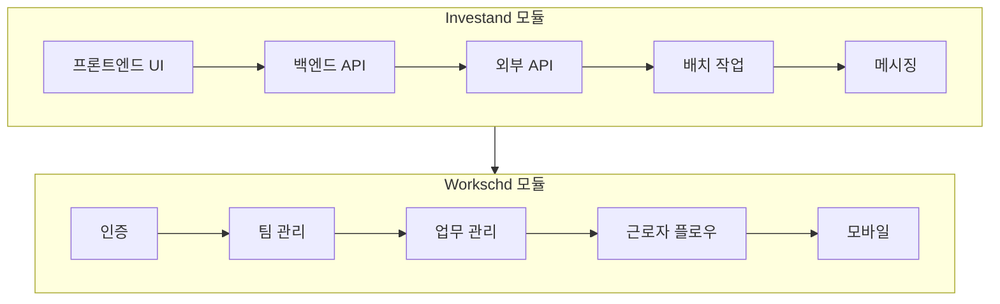

# 통합 테스트 계획 개요

**버전**: 1.1  
**작성일**: 2026-01-18  
**테스트 범위**: 사용자 관점 순차 통합 테스트

---

## 개요

본 문서는 Voyagerss 애플리케이션 모듈별 통합 테스트 계획의 인덱스 역할을 합니다. 각 모듈은 별도의 상세 테스트 계획 문서를 보유하고 있습니다.

## 테스트 계획 문서

| 모듈 | 문서 | 설명 |
|------|------|------|
| **Investand** | [investand-test-plan.md](./investand-test-plan.md) | 투자 대시보드, 시장 데이터, DART 연동, 배치 작업 |
| **Workschd** | [workschd-test-plan.md](./workschd-test-plan.md) | 근무 일정 관리, 팀/업무 관리, 근로자 플로우 |

---

## 전체 테스트 흐름



---

## 빠른 참조

### Investand 모듈 테스트
- **프론트엔드**: 랜딩 페이지, 글로벌 자산, 섹터 비교, DART 페이지, 관리자
- **백엔드 API**: 시장 데이터, Fear & Greed 지수, 섹터, 글로벌 자산, DART, 관리자
- **외부 인터페이스**: DART 오픈 API, Yahoo Finance, KRX
- **배치 작업**: DART 수집, 섹터 수집, 글로벌 자산 수집
- **스케줄러**: 일일 DART 수집 (19:30 KST)
- **메시징**: 텔레그램 봇, 알림 스케줄러

### Workschd 모듈 테스트
- **인증**: 로그인, OAuth (Google/Kakao), 회원가입, 로그아웃
- **팀 관리**: 등록, 멤버, 매장, 초대 링크, 승인
- **업무 관리**: CRUD, 캘린더 뷰, 드래그 앤 드롭, 템플릿
- **근로자 플로우**: 참여 신청, 승인/거절, 출근/퇴근
- **모바일 뷰**: 업무 목록 모바일, 업무 관리 모바일, 반응형
- **알림**: 로드, 읽지 않은 수, 읽음 처리
- **통계**: 대시보드, 팀, 근로자

---

## 테스트 우선순위 요약

### P0 (핵심 경로) - 필수 통과
| 카테고리 | 개수 | 설명 |
|----------|------|------|
| Investand | 15 | 핵심 페이지 로드, API 엔드포인트, 데이터 수집 |
| Workschd | 18 | 인증, 팀/업무 CRUD, 참여 신청, 출퇴근 |

### P1 (중요 기능)
| 카테고리 | 개수 | 설명 |
|----------|------|------|
| Investand | 25 | UI 인터랙션, 외부 API 처리, 배치 옵션 |
| Workschd | 22 | 캘린더, 모바일 뷰, 알림 |

### P2-P3 (경계 케이스)
| 카테고리 | 개수 | 설명 |
|----------|------|------|
| Investand | 15 | 오류 처리, 고급 옵션 |
| Workschd | 12 | 경계 케이스, 고급 기능 |

---

## 테스트 환경

### 공통 요구사항
- Node.js 18+
- PostgreSQL 데이터베이스 구성
- 환경 변수 설정

### URL
- 프론트엔드: `http://localhost:9003`
- 백엔드: `http://localhost:9002`

### 모듈별 요구사항

**Investand:**
- `DART_API_KEY` - DART 오픈 API 접근 키
- `TELEGRAM_BOT_TOKEN` - 메시징 기능용

**Workschd:**
- OAuth 인증 정보 (Google, Kakao)
- 테스트 사용자 계정 (관리자, 매니저, 근로자 역할)

---

## 테스트 실행

```bash
# 백엔드 전체 테스트
cd backend
npm run test

# 프론트엔드 전체 테스트
cd frontend
npm run test

# 특정 모듈 테스트
npm run test -- --grep "investand"
npm run test -- --grep "workschd"

# 배치 작업 (드라이 런)
npm run collect:dart --dry-run
```

---

## 기존 테스트 파일

### 프론트엔드
- `frontend/src/views/investand/tests/`
  - `api-client.test.js`
  - `api-integration.test.js`
  - `composables/*.test.js`

### 백엔드
- `backend/src/modules/investand/tests/`
  - `unit/*.test.ts`
  - `integration/*.test.ts`
  - `system/*.test.ts`
  - `api-integration.test.ts`

---

## 버전 이력

| 버전 | 날짜 | 변경사항 |
|------|------|----------|
| 1.0 | 2026-01-18 | 최초 통합 테스트 계획 |
| 1.1 | 2026-01-18 | 모듈별 문서 분리, 한글화 |
