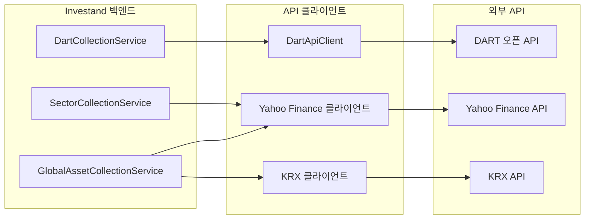
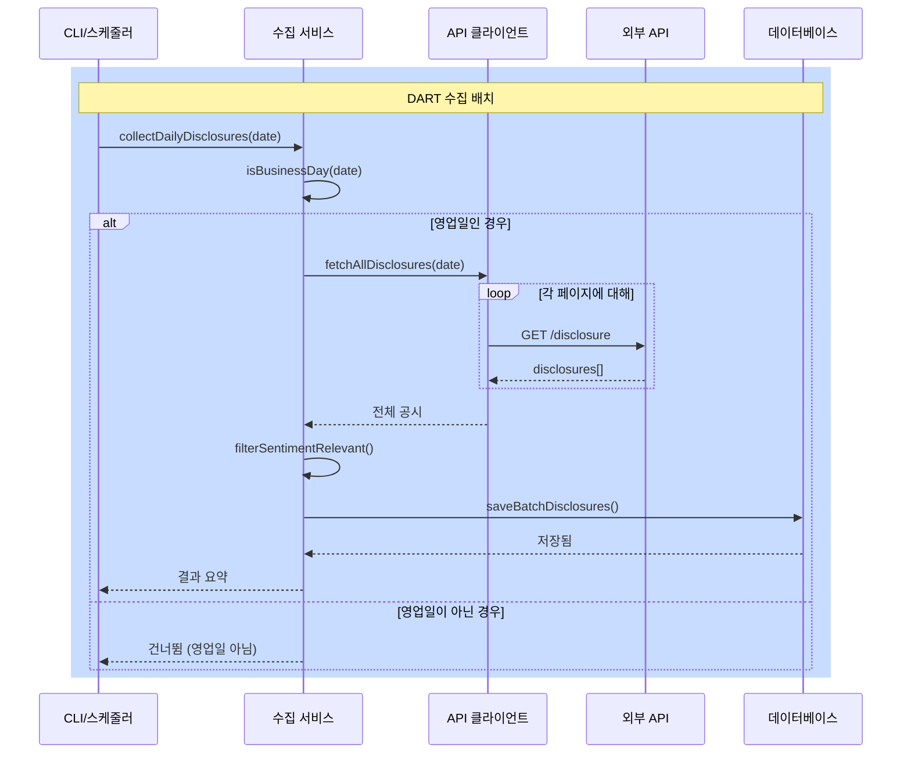
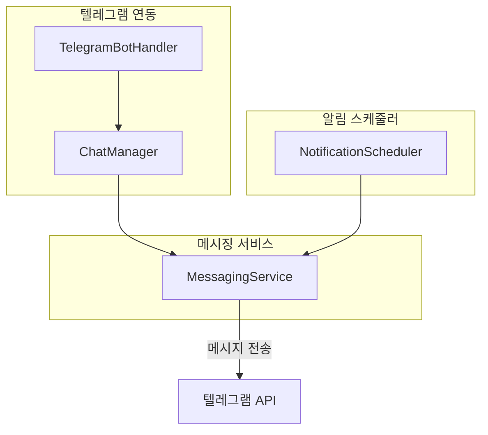

# Investand 모듈 테스트 계획

**버전**: 1.0  
**작성일**: 2026-01-18  
**모듈**: `frontend/src/views/investand`, `backend/src/modules/investand`

---

## 개요

본 문서는 **Investand** 모듈의 통합 테스트 계획을 기술합니다:
- 프론트엔드 UI/UX 테스트
- 백엔드 API 테스트
- 외부 인터페이스 테스트 (DART API, Yahoo Finance)
- 배치 작업 및 스케줄러 테스트
- 메시징 서비스 테스트 (텔레그램)

---

## 테스트 흐름도

```mermaid
flowchart TB
    subgraph Frontend["프론트엔드 UI 테스트"]
        direction TB
        F1[랜딩 페이지 - Fear &#38; Greed]
        F2[Findash - 마켓 랩]
        F3[Findash - 글로벌 자산]
        F4[Findash - 섹터 비교]
        F5[DART 데이터 검색]
        F6[DART 관리]
        F7[관리자 대시보드]
        
        F1 --> F2 --> F3 --> F4 --> F5 --> F6 --> F7
    end

    subgraph Backend["백엔드 API 테스트"]
        direction TB
        B1[시장 데이터 API]
        B2[Fear &#38; Greed API]
        B3[섹터 API]
        B4[글로벌 자산 API]
        B5[DART API]
        B6[관리자 API]
        
        B1 --> B2 --> B3 --> B4 --> B5 --> B6
    end

    subgraph External["외부 인터페이스 테스트"]
        direction TB
        E1[DART 오픈 API 클라이언트]
        E2[Yahoo Finance 클라이언트]
        E3[KRX 클라이언트]
        
        E1 --> E2 --> E3
    end

    subgraph Batch["배치 작업 테스트"]
        direction TB
        BA1[DART 수집 작업]
        BA2[글로벌 자산 수집]
        BA3[섹터 수집]
        BA4[데이터 스케줄러]
        
        BA1 --> BA2 --> BA3 --> BA4
    end

    subgraph Messaging["메시징 테스트"]
        direction TB
        M1[텔레그램 봇]
        M2[알림 스케줄러]
        M3[채팅 매니저]
        
        M1 --> M2 --> M3
    end

    Frontend --> Backend --> External --> Batch --> Messaging
```



---

## 1. 프론트엔드 UI 테스트 시나리오

### T1.1 랜딩 페이지 (IndexPage.vue)

| 테스트 ID | 테스트 케이스 | 사전조건 | 단계 | 기대 결과 | 우선순위 |
|-----------|---------------|----------|------|-----------|----------|
| T1.1.1 | 페이지 초기 로드 | 백엔드 실행 중 | `/investand` 접속 | 로딩 스피너 후 콘텐츠 표시 | P0 |
| T1.1.2 | Fear & Greed 지수 표시 | API 응답 정상 | 페이지 로드 대기 | 현재 점수(0-100), 등급 텍스트, 색상 표시기 | P0 |
| T1.1.3 | 컴포넌트 카드 표시 | API 응답 정상 | 컴포넌트 섹션 확인 | 변동성, 모멘텀, 안전자산, 종목폭 카드 표시 | P1 |
| T1.1.4 | 시장 데이터 (KOSPI/KOSDAQ) | API 응답 정상 | 시장 카드 확인 | 현재값, 변동률, 색상 코딩 | P1 |
| T1.1.5 | 데이터 새로고침 버튼 | 페이지 로드됨 | 새로고침 버튼 클릭 | 데이터 재로드, 버튼 로딩 상태 | P2 |
| T1.1.6 | 오류 처리 | API 실패 | API 오류 시뮬레이션 | 오류 배너 및 재시도 버튼 표시 | P1 |

### T1.2 글로벌 자산 비교 (GlobalAssetComparison.vue)

| 테스트 ID | 테스트 케이스 | 사전조건 | 단계 | 기대 결과 | 우선순위 |
|-----------|---------------|----------|------|-----------|----------|
| T1.2.1 | 페이지 로드 | 메뉴에서 이동 | `/investand/findash/global-assets` 접속 | 헤더, 기간 선택기, 차트 영역 표시 | P0 |
| T1.2.2 | 기간 선택 | 페이지 로드됨 | 1M, 3M, 6M, 1Y 탭 클릭 | 선택된 기간으로 차트 업데이트 | P0 |
| T1.2.3 | 카테고리 필터 | 정규화 데이터 존재 | 원자재/지수/암호화폐 칩 토글 | 선택된 카테고리만 차트에 표시 | P1 |
| T1.2.4 | 자산 토글 버튼 | 차트 표시됨 | 개별 자산 버튼 클릭 | 차트에서 자산 라인 추가/제거 | P1 |
| T1.2.5 | 정규화 버튼 | 자산 선택됨 | "정규화" 버튼 클릭 | 100 기준 정규화 스케일로 차트 표시 | P0 |
| T1.2.6 | 성과 테이블 | 데이터 로드됨 | 테이블로 스크롤 | 자산명, 가격, 변동률, 수익률 표시 | P1 |

### T1.3 섹터 비교 (SectorComparison.vue)

| 테스트 ID | 테스트 케이스 | 사전조건 | 단계 | 기대 결과 | 우선순위 |
|-----------|---------------|----------|------|-----------|----------|
| T1.3.1 | 페이지 로드 | 메뉴에서 이동 | `/investand/findash/sector-comparison` 접속 | 헤더, 통계 카드, 테이블 표시 | P0 |
| T1.3.2 | 통계 카드 표시 | API 응답 정상 | 통계 섹션 확인 | 성과 기록 수, 섹터 수, 최신 날짜 표시 | P1 |
| T1.3.3 | 섹터 성과 테이블 | 데이터 로드됨 | 메인 테이블 확인 | 섹터, 가격, 변동률, 수익률(1M, 3M, 1Y) | P0 |
| T1.3.4 | 섹터 순위 테이블 | 비교 데이터 존재 | 순위로 스크롤 | 순위 뱃지, 상대 성과, 변동성, 샤프 지수 | P1 |
| T1.3.5 | 데이터 수집 버튼 | 페이지 로드됨 | "수집" 클릭 | 로딩 상태, 성공 알림, 데이터 갱신 | P1 |

### T1.4 DART 데이터 페이지 (DartDataPage.vue)

| 테스트 ID | 테스트 케이스 | 사전조건 | 단계 | 기대 결과 | 우선순위 |
|-----------|---------------|----------|------|-----------|----------|
| T1.4.1 | 검색 필터 표시 | 페이지 로드됨 | `/investand/dart-data` 접속 | 날짜 범위, 기업 코드, 유형 드롭다운, 감성 체크박스 | P0 |
| T1.4.2 | 날짜 범위 검색 | 필터 접근 가능 | 시작/종료 날짜 설정, 검색 클릭 | 날짜 범위로 결과 필터링 | P0 |
| T1.4.3 | 기업 코드 검색 | 필터 접근 가능 | 기업 코드 입력, 검색 클릭 | 기업별 결과 필터링 | P1 |
| T1.4.4 | 공시 카드 | 결과 존재 | 공시 목록 확인 | 제목, 기업, 날짜, 접수번호 표시 | P0 |

### T1.5 DART 관리 페이지 (DartManagePage.vue)

| 테스트 ID | 테스트 케이스 | 사전조건 | 단계 | 기대 결과 | 우선순위 |
|-----------|---------------|----------|------|-----------|----------|
| T1.5.1 | 보유현황 검색 | 페이지 로드됨 | 날짜 범위 설정, 검색 클릭 | 테이블에 보유현황 데이터 로드 | P0 |
| T1.5.2 | 통계 섹션 | 검색 완료 | 통계 섹션 확인 | 총 건수, 고유 기업 수, 날짜 범위 표시 | P1 |
| T1.5.3 | Excel 내보내기 | 보유현황 로드됨 | "내보내기" 버튼 클릭 | Excel 파일 다운로드 | P1 |
| T1.5.4 | 페이지네이션 | 다수 결과 | 페이지 이동 | 테이블 업데이트, 페이지 표시기 변경 | P1 |

### T1.6 관리자 페이지

| 테스트 ID | 테스트 케이스 | 사전조건 | 단계 | 기대 결과 | 우선순위 |
|-----------|---------------|----------|------|-----------|----------|
| T1.6.1 | 관리자 대시보드 로드 | 관리자 인증됨 | `/investand/admin/dashboard` 접속 | 시스템 상태, 성능 메트릭 표시 | P1 |
| T1.6.2 | Fear & Greed 관리 | 관리자 인증됨 | `/investand/admin/fear-greed` 접속 | 통계 관리, 기록 조회 | P1 |

---

## 2. 백엔드 API 테스트 시나리오

### T2.1 시장 데이터 API

| 테스트 ID | 테스트 케이스 | 메서드 | 엔드포인트 | 기대 결과 | 우선순위 |
|-----------|---------------|--------|------------|-----------|----------|
| T2.1.1 | KOSPI 데이터 조회 | GET | `/api/investand/data/kospi` | 가격, 변동 포함 KOSPI 지수 데이터 반환 | P0 |
| T2.1.2 | KOSDAQ 데이터 조회 | GET | `/api/investand/data/kosdaq` | 가격, 변동 포함 KOSDAQ 지수 데이터 반환 | P0 |

### T2.2 Fear & Greed API

| 테스트 ID | 테스트 케이스 | 메서드 | 엔드포인트 | 기대 결과 | 우선순위 |
|-----------|---------------|--------|------------|-----------|----------|
| T2.2.1 | 현재 지수 조회 | GET | `/api/investand/fear-greed/current` | 점수(0-100), 등급, 타임스탬프 반환 | P0 |
| T2.2.2 | 통계 조회 | GET | `/api/investand/fear-greed/stats` | 일/주/월간 평균 반환 | P1 |
| T2.2.3 | 히스토리 조회 | GET | `/api/investand/fear-greed/history?days=30` | 날짜/점수 쌍 배열 반환 | P1 |

### T2.3 섹터 API

| 테스트 ID | 테스트 케이스 | 메서드 | 엔드포인트 | 기대 결과 | 우선순위 |
|-----------|---------------|--------|------------|-----------|----------|
| T2.3.1 | 전체 섹터 조회 | GET | `/api/investand/sectors` | 성과 데이터 포함 섹터 목록 반환 | P0 |
| T2.3.2 | 섹터 통계 조회 | GET | `/api/investand/sectors/stats` | 총 기록 수, 섹터 수, 최신 날짜 반환 | P1 |
| T2.3.3 | 섹터 비교 조회 | GET | `/api/investand/sectors/comparisons` | 상대 성과 포함 순위 반환 | P1 |
| T2.3.4 | 섹터 데이터 수집 | POST | `/api/investand/sectors/collect` | Yahoo Finance 데이터 수집 트리거 | P1 |

### T2.4 글로벌 자산 API

| 테스트 ID | 테스트 케이스 | 메서드 | 엔드포인트 | 기대 결과 | 우선순위 |
|-----------|---------------|--------|------------|-----------|----------|
| T2.4.1 | 전체 자산 조회 | GET | `/api/investand/assets` | 성과 데이터 포함 자산 목록 반환 | P0 |
| T2.4.2 | 정규화 데이터 조회 | GET | `/api/investand/assets/normalized?period=1Y` | 비교용 100 기준 정규화 데이터 반환 | P0 |
| T2.4.3 | 카테고리별 자산 조회 | GET | `/api/investand/assets/category/{category}` | 필터링된 자산 반환 (원자재/지수/암호화폐) | P1 |

### T2.5 DART API

| 테스트 ID | 테스트 케이스 | 메서드 | 엔드포인트 | 기대 결과 | 우선순위 |
|-----------|---------------|--------|------------|-----------|----------|
| T2.5.1 | DART 통계 조회 | GET | `/api/investand/dart/stats` | 총 공시 수, 마지막 업데이트 반환 | P1 |
| T2.5.2 | 공시 조회 | GET | `/api/investand/dart/disclosures?startDate=&endDate=` | 페이지네이션된 공시 목록 반환 | P0 |
| T2.5.3 | 배치 상태 조회 | GET | `/api/investand/dart/batch/status` | 배치 작업 상태, 마지막/다음 실행 반환 | P1 |
| T2.5.4 | 상태 확인 | GET | `/api/investand/dart/health` | DART 서비스 상태 반환 | P2 |

### T2.6 관리자 API

| 테스트 ID | 테스트 케이스 | 메서드 | 엔드포인트 | 기대 결과 | 우선순위 |
|-----------|---------------|--------|------------|-----------|----------|
| T2.6.1 | 시스템 상태 조회 | GET | `/api/investand/admin/system-health` | 데이터베이스, API, 데이터 수집 상태 반환 | P1 |
| T2.6.2 | 성능 메트릭 조회 | GET | `/api/investand/admin/performance-metrics` | CPU, 메모리, 디스크, 네트워크 통계 반환 | P2 |

---

## 3. 외부 인터페이스 테스트 시나리오

### 외부 인터페이스 아키텍처



### T3.1 DART 오픈 API 클라이언트 (DartApiClient.ts)

| 테스트 ID | 테스트 케이스 | 사전조건 | 단계 | 기대 결과 | 우선순위 |
|-----------|---------------|----------|------|-----------|----------|
| T3.1.1 | 일별 공시 조회 | DART API 키 유효 | `fetchDisclosures(date, 'D')` 호출 | 해당 날짜 공시 목록 반환 | P0 |
| T3.1.2 | 지분 공시 조회 | DART API 키 유효 | 보고서 유형 'D'로 호출 | 지분 보유 공시만 반환 | P0 |
| T3.1.3 | 페이지네이션 처리 | 대량 결과 집합 | 다중 페이지 조회 | 모든 페이지 정확히 수집 | P1 |
| T3.1.4 | API 속도 제한 | 다수 요청 | 빠른 요청 생성 | 속도 제한 준수, 429 오류 없음 | P1 |
| T3.1.5 | API 키 검증 | 잘못된 키 | 잘못된 키로 호출 | 적절한 오류 메시지 반환 | P2 |
| T3.1.6 | 연결 타임아웃 | 네트워크 문제 | 타임아웃 시뮬레이션 | 우아한 오류 처리, 재시도 로직 | P1 |

### T3.2 Yahoo Finance 클라이언트 (SectorApiClient.ts, GlobalAssetClient.ts)

| 테스트 ID | 테스트 케이스 | 사전조건 | 단계 | 기대 결과 | 우선순위 |
|-----------|---------------|----------|------|-----------|----------|
| T3.2.1 | 섹터 ETF 데이터 조회 | 네트워크 가용 | `fetchSectorData('XLK')` 호출 | 기술 섹터 데이터 반환 | P0 |
| T3.2.2 | 전체 섹터 데이터 조회 | 네트워크 가용 | 11개 전체 섹터 호출 | 모든 섹터 ETF 데이터 반환 | P0 |
| T3.2.3 | 글로벌 자산 데이터 조회 | 네트워크 가용 | `fetchAssetData('GOLD')` 호출 | 금 가격 히스토리 반환 | P0 |
| T3.2.4 | 정규화 데이터 조회 | 과거 데이터 존재 | `collectNormalizedAssetData('1Y')` 호출 | 100 기준 정규화 값 반환 | P1 |
| T3.2.5 | 시장 시간 확인 | -- | `shouldCollectData()` 호출 | 시장 시간에 따라 true/false 반환 | P2 |
| T3.2.6 | 오류 처리 | 잘못된 심볼 | 존재하지 않는 심볼 조회 | 크래시 없이 오류 반환 | P1 |

### T3.3 KRX 클라이언트

| 테스트 ID | 테스트 케이스 | 사전조건 | 단계 | 기대 결과 | 우선순위 |
|-----------|---------------|----------|------|-----------|----------|
| T3.3.1 | KOSPI 데이터 조회 | 네트워크 가용 | KOSPI용 KRX API 호출 | 현재 KOSPI 지수 반환 | P1 |
| T3.3.2 | KOSDAQ 데이터 조회 | 네트워크 가용 | KOSDAQ용 KRX API 호출 | 현재 KOSDAQ 지수 반환 | P1 |

---

## 4. 배치 작업 테스트 시나리오

### 배치 작업 흐름도



### T4.1 DART 수집 배치 (collectDartData.ts)

| 테스트 ID | 테스트 케이스 | 사전조건 | 단계 | 기대 결과 | 우선순위 |
|-----------|---------------|----------|------|-----------|----------|
| T4.1.1 | 오늘 날짜로 실행 | DART API 가용 | `npm run collect:dart` | 오늘 공시 수집 | P0 |
| T4.1.2 | 특정 날짜로 실행 | DART API 가용 | `npm run collect:dart 2024-01-15` | 해당 날짜 공시 수집 | P0 |
| T4.1.3 | 어제 날짜로 실행 | DART API 가용 | `npm run collect:dart yesterday` | 어제 공시 수집 | P1 |
| T4.1.4 | 마지막 영업일 실행 | DART API 가용 | `npm run collect:dart last-business` | 주말/공휴일 건너뜀 | P1 |
| T4.1.5 | 드라이 런 모드 | -- | `npm run collect:dart --dry-run` | 미리보기만, DB 저장 없음 | P1 |
| T4.1.6 | 저장 안 함 모드 | -- | `npm run collect:dart --no-save` | 수집 후 저장 안 함 | P2 |
| T4.1.7 | 최대 페이지 옵션 | -- | `npm run collect:dart --max-pages=10` | 10페이지로 수집 제한 | P2 |
| T4.1.8 | 잘못된 날짜 형식 | -- | `npm run collect:dart 15-01-2024` | 오류 메시지 및 사용법 표시 | P2 |
| T4.1.9 | 미래 날짜 | -- | `npm run collect:dart 2030-01-01` | 미래 날짜 거부 | P2 |
| T4.1.10 | 도움말 명령 | -- | `npm run collect:dart --help` | 사용법 도움말 표시 | P3 |

### T4.2 DartCollectionService

| 테스트 ID | 테스트 케이스 | 사전조건 | 단계 | 기대 결과 | 우선순위 |
|-----------|---------------|----------|------|-----------|----------|
| T4.2.1 | 일별 공시 수집 | API 가용 | `collectDailyDisclosures(date, true)` 호출 | 총 건수 및 지분 공시 반환 | P0 |
| T4.2.2 | 감성 관련 필터링 | 공시 존재 | `filterSentimentRelevantDisclosures()` 호출 | D 유형 중요 변동만 반환 | P1 |
| T4.2.3 | 배치 공시 저장 | 데이터 수집됨 | `saveBatchDisclosures(disclosures)` 호출 | 공시 데이터베이스 저장 | P0 |
| T4.2.4 | 영업일 확인 | -- | `isBusinessDay('2024-01-15')` 호출 | 평일 true, 그 외 false 반환 | P1 |
| T4.2.5 | 마지막 영업일 계산 | -- | `getLastBusinessDay(1)` 호출 | 마지막 유효 영업일 반환 | P1 |
| T4.2.6 | 보유 비율 추출 | 보고서명 | `extractHoldingPercentage(reportName, 'after')` 호출 | 보고서명에서 비율 추출 | P2 |
| T4.2.7 | 영향 점수 계산 | 보고서명 | `calculateImpactScore(reportName)` 호출 | 0-100 영향 점수 반환 | P2 |
| T4.2.8 | 시장 영향 평가 | 기업 + 보고서 | `assessMarketImpact(corpName, reportName)` 호출 | 영향 수준 반환: LOW/MEDIUM/HIGH | P2 |

### T4.3 섹터 수집 서비스

| 테스트 ID | 테스트 케이스 | 사전조건 | 단계 | 기대 결과 | 우선순위 |
|-----------|---------------|----------|------|-----------|----------|
| T4.3.1 | 일별 섹터 데이터 수집 | Yahoo API 가용 | `collectDailySectorData()` 호출 | 전체 섹터 데이터 반환 | P0 |
| T4.3.2 | 섹터 비교 수집 | 벤치마크 데이터 존재 | `collectSectorComparisons(date, 'SPY')` 호출 | S&P 500 대비 상대 성과 반환 | P1 |
| T4.3.3 | 단일 섹터 수집 | Yahoo API 가용 | `collectSectorData('XLK', 365)` 호출 | 기술 섹터 1년 데이터 반환 | P1 |
| T4.3.4 | 벤치마크 데이터 조회 | Yahoo API 가용 | `fetchBenchmarkData('SPY', 365)` 호출 | S&P 500 ETF 데이터 반환 | P1 |

### T4.4 글로벌 자산 수집 서비스

| 테스트 ID | 테스트 케이스 | 사전조건 | 단계 | 기대 결과 | 우선순위 |
|-----------|---------------|----------|------|-----------|----------|
| T4.4.1 | 일별 자산 데이터 수집 | Yahoo API 가용 | `collectDailyAssetData()` 호출 | 전체 글로벌 자산 데이터 반환 | P0 |
| T4.4.2 | 정규화 데이터 수집 | 과거 데이터 존재 | `collectNormalizedAssetData('1Y')` 호출 | 100 기준 정규화 데이터 반환 | P0 |
| T4.4.3 | 카테고리별 수집 | Yahoo API 가용 | `collectAssetDataByCategory('commodity', 365)` 호출 | 원자재 자산만 반환 | P1 |
| T4.4.4 | 상관관계 계산 | 가격 데이터 존재 | `calculateAssetCorrelations(30)` 호출 | 상관관계 행렬 반환 | P2 |

---

## 5. 스케줄러 테스트 시나리오

### T5.1 데이터 스케줄러 (DataScheduler.ts)

| 테스트 ID | 테스트 케이스 | 사전조건 | 단계 | 기대 결과 | 우선순위 |
|-----------|---------------|----------|------|-----------|----------|
| T5.1.1 | 스케줄러 시작 | 스케줄러 미실행 | `DataScheduler.getInstance().start()` 호출 | 스케줄러 시작, 로그 메시지 | P0 |
| T5.1.2 | 스케줄러 중지 | 스케줄러 실행 중 | `scheduler.stop()` 호출 | 모든 인터벌 클리어, 정상 종료 | P0 |
| T5.1.3 | 싱글톤 패턴 | -- | `getInstance()` 두 번 호출 | 동일 인스턴스 반환 | P2 |
| T5.1.4 | 일일 DART 수집 트리거 | 스케줄러 실행 중 | 19:30 KST 대기 | DART 수집 자동 실행 | P1 |
| T5.1.5 | 영업일 아닌 경우 건너뜀 | 주말 | 예정 시간 대기 | 수집 건너뜀, 로그 메시지 | P1 |
| T5.1.6 | 중복 시작 방지 | 이미 실행 중 | `start()` 다시 호출 | 경고 로그, 중복 스케줄러 없음 | P2 |

---

## 6. 메시징 서비스 테스트 시나리오

### 메시징 아키텍처



### T6.1 텔레그램 봇 핸들러

| 테스트 ID | 테스트 케이스 | 사전조건 | 단계 | 기대 결과 | 우선순위 |
|-----------|---------------|----------|------|-----------|----------|
| T6.1.1 | 봇 초기화 | 봇 토큰 유효 | 봇 핸들러 초기화 | 봇이 텔레그램에 연결 | P1 |
| T6.1.2 | /start 명령 처리 | 봇 실행 중 | 봇에 /start 전송 | 환영 메시지 응답 | P1 |
| T6.1.3 | 알 수 없는 명령 처리 | 봇 실행 중 | 알 수 없는 명령 전송 | 도움말 메시지 응답 | P2 |
| T6.1.4 | 웹훅 설정 | 봇 실행 중 | 웹훅 구성 | 웹훅 등록 성공 | P1 |

### T6.2 알림 스케줄러

| 테스트 ID | 테스트 케이스 | 사전조건 | 단계 | 기대 결과 | 우선순위 |
|-----------|---------------|----------|------|-----------|----------|
| T6.2.1 | 일일 알림 예약 | 스케줄러 실행 중 | 일일 알림 구성 | 시간에 알림 대기열 추가 | P1 |
| T6.2.2 | 예약 알림 전송 | 예약 시간 도달 | 트리거 대기 | 구성된 수신자에게 메시지 전송 | P1 |
| T6.2.3 | 알림 재시도 | 전송 실패 | 실패 시뮬레이션 | 지수 백오프로 재시도 | P2 |

### T6.3 메시징 서비스

| 테스트 ID | 테스트 케이스 | 사전조건 | 단계 | 기대 결과 | 우선순위 |
|-----------|---------------|----------|------|-----------|----------|
| T6.3.1 | 메시지 전송 | 채팅 ID 유효 | `sendMessage(chatId, text)` 호출 | 텔레그램에 메시지 전달 | P1 |
| T6.3.2 | 브로드캐스트 메시지 | 다수 수신자 | `broadcastMessage(chatIds, text)` 호출 | 모든 수신자에게 메시지 수신 | P2 |
| T6.3.3 | 시장 리포트 포맷 | 데이터 가용 | `formatMarketReport(data)` 호출 | 포맷된 마크다운 메시지 반환 | P2 |

---

## 7. 테스트 실행 순서

### 1단계: 핵심 기능 (P0 테스트)
1. **T1.1.1-T1.1.2**: 랜딩 페이지 기본 로드
2. **T2.1-T2.5**: 백엔드 API 엔드포인트
3. **T3.1.1-T3.1.2, T3.2.1-T3.2.3**: 외부 API 클라이언트
4. **T4.1.1-T4.1.2**: DART 배치 수집 기본

### 2단계: 기능 테스트 (P1 테스트)
5. **T1.1.3-T1.6**: 나머지 프론트엔드 테스트
6. **T3.1.3-T3.2.6**: 외부 인터페이스 경계 케이스
7. **T4.2-T4.4**: 수집 서비스
8. **T5.1.1-T5.1.5**: 스케줄러 테스트
9. **T6.1-T6.3**: 메시징 테스트

### 3단계: 경계 케이스 (P2-P3 테스트)
10. 나머지 테스트

---

## 8. 테스트 환경

### 필수 조건
- Node.js 18+
- PostgreSQL 데이터베이스
- 유효한 DART API 키 (`DART_API_KEY` 환경 변수)
- 프론트엔드: `http://localhost:9003`
- 백엔드: `http://localhost:9002`

### 환경 변수
```bash
DART_API_KEY=your_dart_api_key
TELEGRAM_BOT_TOKEN=your_bot_token
DATABASE_URL=postgresql://...
```

### 테스트 실행
```bash
# 백엔드 단위 테스트
cd backend
npm run test

# 백엔드 통합 테스트
npm run test:integration

# 특정 배치 테스트
npm run collect:dart --dry-run

# 프론트엔드 테스트
cd frontend
npm run test
```

---

## 부록: 자산 코드 참조

### 섹터 ETF 코드
| 코드 | 섹터 | ETF |
|------|------|-----|
| XLY | 임의소비재 | SPDR |
| XLP | 필수소비재 | SPDR |
| XLE | 에너지 | SPDR |
| XLF | 금융 | SPDR |
| XLV | 헬스케어 | SPDR |
| XLI | 산업재 | SPDR |
| XLB | 소재 | SPDR |
| XLRE | 부동산 | SPDR |
| XLK | 기술 | SPDR |
| XLC | 통신서비스 | SPDR |
| XLU | 유틸리티 | SPDR |

### 글로벌 자산 코드
| 카테고리 | 자산 |
|----------|------|
| 원자재 | GOLD, SILVER, COPPER, WTI, BRENT, NATGAS |
| 지수 | SPX, NDX, DJI, FTSE, DAX, NIKKEI, KOSPI, KOSDAQ |
| 암호화폐 | BTC, ETH |
| 외환 | USDKRW, USDJPY, EURUSD, USDCNY |
| 달러 지수 | DXY |
| 부동산 | REIT, HOMZ |

---

## 버전 이력

| 버전 | 날짜 | 변경사항 |
|------|------|----------|
| 1.0 | 2026-01-18 | 최초 Investand 테스트 계획 (한글) |
