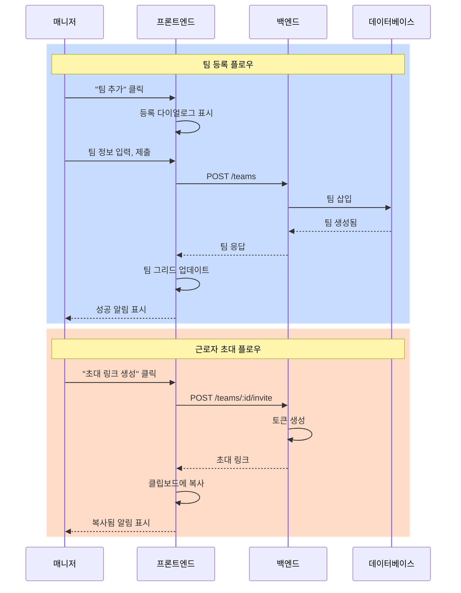
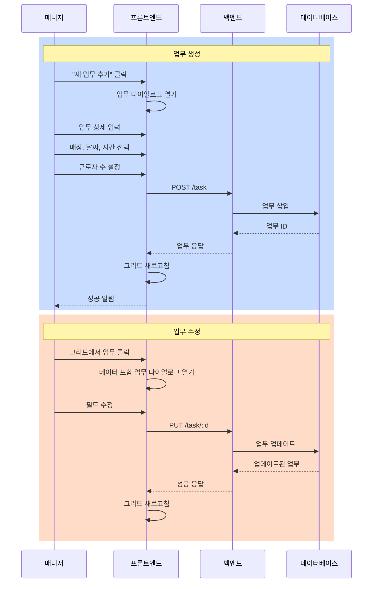
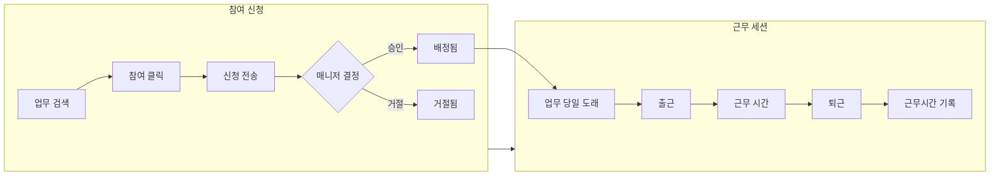

# Workschd 모듈 테스트 계획

**버전**: 1.0  
**작성일**: 2026-01-18  
**모듈**: `frontend/src/views/workschd`, `backend/src/modules/workschd`

---

## 개요

본 문서는 **Workschd** (근무 일정 관리) 모듈의 통합 테스트 계획을 기술합니다:
- 인증 및 사용자 관리
- 팀 관리 (등록, 멤버, 매장)
- 업무 관리 (CRUD, 캘린더, 템플릿)
- 근로자 플로우 (참여 신청, 출퇴근)
- 모바일 뷰
- 알림 및 통계

---

## 테스트 흐름도

```mermaid
flowchart TB
    subgraph Auth["인증"]
        A1[로그인] --> A2[OAuth]
        A2 --> A3[회원가입]
        A3 --> A4[로그아웃]
    end

    subgraph Team["팀 관리"]
        T1[팀 등록] --> T2[팀 조회]
        T2 --> T3[팀 상세]
        T3 --> T4[멤버 탭]
        T4 --> T5[매장 탭]
        T5 --> T6[일정 설정]
        T3 --> T7[초대 링크]
    end

    subgraph Task["업무 관리"]
        TK1[업무 생성] --> TK2[업무 그리드]
        TK2 --> TK3[캘린더 뷰]
        TK3 --> TK4[드래그 &#38; 드롭]
        TK4 --> TK5[시프트 템플릿]
    end

    subgraph Worker["근로자 플로우"]
        W1[참여 신청] --> W2[승인/거절]
        W2 --> W3[출근]
        W3 --> W4[퇴근]
    end

    subgraph Mobile["모바일 뷰"]
        M1[업무 목록 모바일]
        M2[업무 관리 모바일]
    end

    Auth --> Team --> Task --> Worker --> Mobile
```



---

## 1. 인증 테스트 시나리오

### T1.0 인증 플로우

| 테스트 ID | 테스트 케이스 | 사전조건 | 단계 | 기대 결과 | 우선순위 |
|-----------|---------------|----------|------|-----------|----------|
| T1.0.1 | 기본 로그인 | 사용자 존재 | 로그인 화면 접속, 자격증명 입력 | 홈/대시보드로 리다이렉트 | P0 |
| T1.0.2 | 로그인 유효성 검사 | 로그인 폼 표시 | 빈 폼 제출 | 유효성 오류 표시 | P1 |
| T1.0.3 | 잘못된 자격증명 | 로그인 폼 표시 | 잘못된 비밀번호 입력 | 오류 메시지 표시 | P0 |
| T1.0.4 | Google OAuth | 로그인 페이지 표시 | Google 버튼 클릭 | Google로 리다이렉트, 콜백 작동 | P1 |
| T1.0.5 | Kakao OAuth | 로그인 페이지 표시 | Kakao 버튼 클릭 | Kakao로 리다이렉트, 콜백 작동 | P1 |
| T1.0.6 | 회원가입 | 로그인 페이지 표시 | 회원가입 클릭, 폼 작성 | 계정 생성, 로그인 완료 | P0 |
| T1.0.7 | 로그아웃 | 사용자 로그인됨 | 로그아웃 클릭 | 세션 클리어, 로그인 화면으로 리다이렉트 | P1 |
| T1.0.8 | 토큰 갱신 | 세션 만료 | 토큰 만료 대기 | 토큰 자동 갱신 | P2 |

**테스트 API 엔드포인트:**
- `POST /api/workschd/auth/login`
- `POST /api/workschd/auth/signup`
- `GET /api/workschd/auth/google`
- `GET /api/workschd/auth/google/callback`
- `GET /api/workschd/auth/kakao`
- `GET /api/workschd/auth/kakao/callback`

---

## 2. 팀 관리 테스트 시나리오

### 팀 관리 플로우



### T2.1 팀 관리 (TeamManage.vue)

| 테스트 ID | 테스트 케이스 | 사전조건 | 단계 | 기대 결과 | 우선순위 |
|-----------|---------------|----------|------|-----------|----------|
| T2.1.1 | 페이지 로드 | 사용자 인증됨 | `/workschd/team/manage` 접속 | 팀 그리드 표시, 팀 추가 버튼 | P0 |
| T2.1.2 | 새 팀 등록 | 페이지 로드됨 | "팀 추가" 클릭, 다이얼로그 작성 | 팀 생성, 그리드에 표시 | P0 |
| T2.1.3 | 팀 유효성 검사 | 등록 다이얼로그 | 빈 이름으로 제출 | 유효성 오류 표시 | P1 |
| T2.1.4 | 팀 상세 보기 | 팀 존재 | 그리드에서 팀명 클릭 | 탭이 있는 상세 섹션 표시 | P0 |
| T2.1.5 | 멤버 탭 | 팀 선택됨 | "멤버" 탭 클릭 | 페이지네이션 포함 멤버 그리드 로드 | P1 |
| T2.1.6 | 매장 탭 | 팀 선택됨 | "매장" 탭 클릭 | 매장 관리 컴포넌트 로드 | P1 |
| T2.1.7 | 일정 설정 탭 | 팀 선택됨 | "일정 설정" 탭 클릭 | 일정 설정 컴포넌트 로드 | P2 |
| T2.1.8 | 초대 링크 생성 | 팀 선택됨 | 초대 링크 아이콘 클릭 | 클립보드에 링크 복사, 알림 | P1 |
| T2.1.9 | 팀 페이지네이션 | 다수 팀 | 페이지 이동 | 그리드 정상 업데이트 | P2 |
| T2.1.10 | 팀 삭제 | 팀 선택됨 | 삭제 클릭, 확인 | 그리드에서 팀 제거 | P2 |

### T2.2 팀 멤버

| 테스트 ID | 테스트 케이스 | 사전조건 | 단계 | 기대 결과 | 우선순위 |
|-----------|---------------|----------|------|-----------|----------|
| T2.2.1 | 멤버 목록 조회 | 팀에 멤버 존재 | 멤버 탭 열기 | 역할 포함 멤버 표시 | P0 |
| T2.2.2 | 멤버 페이지네이션 | 다수 멤버 | 페이지 이동 | 그리드 정상 업데이트 | P2 |
| T2.2.3 | 멤버 상세 | 멤버 존재 | 멤버 행 클릭 | 멤버 상세 모달 열림 | P1 |
| T2.2.4 | 멤버 역할 수정 | 멤버 선택됨 | 역할 드롭다운 변경 | 역할 업데이트, 알림 | P2 |
| T2.2.5 | 멤버 제거 | 멤버 선택됨 | 제거 버튼 클릭 | 팀에서 멤버 제거 | P2 |

### T2.3 참여 신청 플로우 (TeamJoin.vue)

| 테스트 ID | 테스트 케이스 | 사전조건 | 단계 | 기대 결과 | 우선순위 |
|-----------|---------------|----------|------|-----------|----------|
| T2.3.1 | 링크로 참여 | 유효한 초대 링크 | `/workschd/team/join/:token` 접속 | 참여 폼 표시 | P0 |
| T2.3.2 | 참여 신청 제출 | 참여 폼 표시 | 폼 작성, 제출 | 신청 제출됨, 대기 상태 | P0 |
| T2.3.3 | 만료된 초대 링크 | 잘못된/만료된 토큰 | 참여 URL 접속 | 오류 메시지 표시 | P1 |
| T2.3.4 | 이미 멤버인 경우 | 사용자가 이미 팀 소속 | 같은 팀 참여 시도 | "이미 멤버입니다" 메시지 | P2 |

### T2.4 팀 승인 (TeamApproveDialog.vue)

| 테스트 ID | 테스트 케이스 | 사전조건 | 단계 | 기대 결과 | 우선순위 |
|-----------|---------------|----------|------|-----------|----------|
| T2.4.1 | 대기 신청 조회 | 대기 신청 존재 | 승인 다이얼로그 열기 | 사용자 정보 포함 신청 목록 | P0 |
| T2.4.2 | 신청 승인 | 신청 선택됨 | 승인 클릭 | 팀에 사용자 추가, 알림 | P0 |
| T2.4.3 | 신청 거절 | 신청 선택됨 | 거절 클릭 | 신청 제거, 사용자에게 알림 | P1 |

**테스트 API 엔드포인트:**
- `GET /api/workschd/team`
- `POST /api/workschd/teams`
- `GET /api/workschd/teams/:id`
- `PUT /api/workschd/teams/:id`
- `DELETE /api/workschd/teams/:id`
- `GET /api/workschd/teams/:id/members`

---

## 3. 업무 관리 테스트 시나리오

### 업무 CRUD 플로우



### T3.1 업무 CRUD (TaskManage.vue)

| 테스트 ID | 테스트 케이스 | 사전조건 | 단계 | 기대 결과 | 우선순위 |
|-----------|---------------|----------|------|-----------|----------|
| T3.1.1 | 페이지 로드 | 사용자 인증됨 | `/workschd/task/manage` 접속 | 업무 그리드, 업무 추가 버튼, 캘린더 뷰 | P0 |
| T3.1.2 | 새 업무 생성 | 페이지 로드됨 | "새 업무 추가" 클릭, 다이얼로그 작성 | 업무 생성, 그리드에 표시 | P0 |
| T3.1.3 | 업무 유효성 검사 | 생성 다이얼로그 열림 | 필수 필드 없이 제출 | 유효성 오류 표시 | P1 |
| T3.1.4 | 업무 그리드 표시 | 업무 존재 | 그리드 확인 | ID, 매장, 팀, 제목, 근로자 수, 상태 표시 | P0 |
| T3.1.5 | 업무 다이얼로그 열기 | 업무 존재 | 그리드에서 업무 클릭 | 상세 정보, 근로자 탭 포함 다이얼로그 열림 | P1 |
| T3.1.6 | 업무 수정 | 다이얼로그 열림 | 필드 수정, 저장 클릭 | 업무 업데이트, 그리드 새로고침 | P1 |
| T3.1.7 | 업무 삭제 | 업무 선택됨 | 삭제 클릭, 확인 | 그리드에서 업무 제거 | P2 |
| T3.1.8 | 업무 근로자 조회 | 업무에 근로자 배정됨 | 다이얼로그에서 근로자 탭 열기 | 배정된 근로자 목록 표시 | P1 |

### T3.2 캘린더 뷰

| 테스트 ID | 테스트 케이스 | 사전조건 | 단계 | 기대 결과 | 우선순위 |
|-----------|---------------|----------|------|-----------|----------|
| T3.2.1 | 주간 뷰 | 업무 존재 | "주간" 뷰 선택 | 7일 캘린더 그리드에 업무 표시 | P1 |
| T3.2.2 | 월간 뷰 | 업무 존재 | "월간" 뷰 선택 | 30일 뷰 표시 | P2 |
| T3.2.3 | 주간 이동 | 주간 뷰 활성 | 다음/이전 화살표 클릭 | 다음/이전 주로 캘린더 이동 | P2 |
| T3.2.4 | 캘린더에서 업무 클릭 | 업무 칩 표시 | 업무 칩 클릭 | 업무 다이얼로그 열림 | P1 |
| T3.2.5 | 업무 드래그 앤 드롭 | 캘린더 표시 | 업무 칩을 새 날짜로 드래그 | 업무 날짜 업데이트 | P2 |
| T3.2.6 | 충돌 경고 | 중복 업무 | 중복 업무 생성 | 빨간 배너 경고 표시 | P1 |

### T3.3 시프트 템플릿

| 테스트 ID | 테스트 케이스 | 사전조건 | 단계 | 기대 결과 | 우선순위 |
|-----------|---------------|----------|------|-----------|----------|
| T3.3.1 | 템플릿 다이얼로그 열기 | 페이지 로드됨 | 템플릿 버튼 클릭 | 템플릿 선택 다이얼로그 열림 | P2 |
| T3.3.2 | 템플릿 적용 | 템플릿 선택됨 | 템플릿 클릭 | 템플릿 값으로 업무 미리 채움 | P2 |
| T3.3.3 | 커스텀 템플릿 생성 | 템플릿 다이얼로그 | 커스텀 값 입력, 저장 | 재사용을 위한 템플릿 저장 | P3 |

**테스트 API 엔드포인트:**
- `GET /api/workschd/task`
- `POST /api/workschd/task`
- `PUT /api/workschd/task/:id`
- `DELETE /api/workschd/task/:id`
- `POST /api/workschd/task/tasks` (일괄 생성)
- `GET /api/workschd/task/:id/employees`

---

## 4. 근로자 플로우 테스트 시나리오

### 근로자 여정 플로우



### T4.1 참여 신청 플로우

| 테스트 ID | 테스트 케이스 | 사전조건 | 단계 | 기대 결과 | 우선순위 |
|-----------|---------------|----------|------|-----------|----------|
| T4.1.1 | 가능 업무 조회 | 근로자 로그인됨 | 업무 목록 이동 | 참여 가능 업무 표시 | P0 |
| T4.1.2 | 참여 신청 제출 | 업무 선택됨 | 업무에서 "참여" 클릭 | 신청 제출, 알림 전송 | P0 |
| T4.1.3 | 신청 대기 상태 | 신청 제출됨 | 업무 확인 | 대기 상태 표시 | P1 |
| T4.1.4 | 매니저 알림 수신 | 신청 제출됨 | 매니저 알림 열기 | 새 참여 신청 알림 | P1 |
| T4.1.5 | 매니저 승인 | 매니저 로그인, 대기 신청 | "승인" 클릭 | 업무에 근로자 추가, 알림 전송 | P0 |
| T4.1.6 | 매니저 거절 | 매니저 로그인, 대기 신청 | "거절" 클릭 | 신청 거절, 근로자에게 알림 | P1 |
| T4.1.7 | 본인 신청 취소 | 근로자 로그인, 본인 대기 신청 | "취소" 클릭 | 신청 취소됨 | P2 |
| T4.1.8 | 중복 신청 방지 | 이미 신청함 | 같은 업무 참여 시도 | 오류: 이미 신청됨 | P2 |

**테스트 API 엔드포인트:**
- `POST /api/workschd/task/:taskId/request`
- `POST /api/workschd/task/request/:requestId/approve`
- `POST /api/workschd/task/request/:requestId/reject`
- `DELETE /api/workschd/task/request/:requestId`

### T4.2 출퇴근 플로우

| 테스트 ID | 테스트 케이스 | 사전조건 | 단계 | 기대 결과 | 우선순위 |
|-----------|---------------|----------|------|-----------|----------|
| T4.2.1 | 출근 버튼 표시 | 근로자가 업무에 배정됨 | 업무 당일 업무 확인 | 출근 버튼 활성화 | P0 |
| T4.2.2 | 출근 | 근로자 배정됨 | "출근" 클릭 | 타임스탬프 기록, 상태 "근무중"으로 업데이트 | P0 |
| T4.2.3 | 출근 위치 | GPS 활성화 | 위치와 함께 출근 | 위도/경도 기록 | P2 |
| T4.2.4 | 퇴근 | 근로자 출근함 | "퇴근" 클릭 | 타임스탬프 기록, 근무시간 계산 | P0 |
| T4.2.5 | 이른 출근 | 업무 시작 전 | 출근 시도 | 설정에 따라 경고 또는 차단 | P2 |
| T4.2.6 | 늦은 출근 | 업무 시작 후 | 출근 | 지각 플래그 기록 | P2 |
| T4.2.7 | 배정 없이 출근 | 배정 안 됨 | 출근 시도 | 오류: 업무에 배정되지 않음 | P1 |
| T4.2.8 | 중복 출근 방지 | 이미 출근함 | 다시 출근 시도 | 오류: 이미 출근함 | P2 |

**테스트 API 엔드포인트:**
- `POST /api/workschd/task-employee/:taskEmployeeId/check-in`
- `POST /api/workschd/task-employee/:taskEmployeeId/check-out`

---

## 5. 모바일 뷰 테스트 시나리오

### T5.1 업무 목록 모바일 (TaskListMobile.vue)

| 테스트 ID | 테스트 케이스 | 사전조건 | 단계 | 기대 결과 | 우선순위 |
|-----------|---------------|----------|------|-----------|----------|
| T5.1.1 | 페이지 로드 | 근로자 로그인됨 | `/workschd/task/list-mobile` 접속 | 모바일 최적화 업무 목록 표시 | P1 |
| T5.1.2 | 업무 카드 | 업무 존재 | 목록 확인 | 스와이프 가능 카드로 업무 표시 | P1 |
| T5.1.3 | 당겨서 새로고침 | 페이지 로드됨 | 아래로 당기기 | 업무 새로고침 | P2 |
| T5.1.4 | 업무 상세 | 업무 카드 표시 | 업무 카드 탭 | 확장 가능 상세 표시 | P1 |
| T5.1.5 | 빠른 출근 | 배정된 업무 | 스와이프 또는 출근 탭 | 출근 기록 | P1 |

### T5.2 업무 관리 모바일 (TaskManageMobile.vue)

| 테스트 ID | 테스트 케이스 | 사전조건 | 단계 | 기대 결과 | 우선순위 |
|-----------|---------------|----------|------|-----------|----------|
| T5.2.1 | 페이지 로드 | 매니저 로그인됨 | `/workschd/task/manage-mobile` 접속 | 모바일 관리 뷰 | P1 |
| T5.2.2 | 모바일 업무 생성 | 페이지 로드됨 | "+" 버튼 탭 | 모바일 업무 생성 폼 | P1 |
| T5.2.3 | 오늘 업무 조회 | 업무 존재 | 기본 뷰 확인 | 오늘 업무 강조 표시 | P1 |

### T5.3 반응형 레이아웃

| 테스트 ID | 테스트 케이스 | 사전조건 | 단계 | 기대 결과 | 우선순위 |
|-----------|---------------|----------|------|-----------|----------|
| T5.3.1 | 모바일 뷰포트 | 아무 페이지 | 뷰포트 375x667 설정 | 모바일로 레이아웃 적응 | P1 |
| T5.3.2 | 태블릿 뷰포트 | 아무 페이지 | 뷰포트 768x1024 설정 | 태블릿으로 레이아웃 적응 | P2 |
| T5.3.3 | 터치 인터랙션 | 모바일 뷰 | 터치 제스처 사용 | 모든 인터랙션 터치로 작동 | P2 |

---

## 6. 알림 테스트 시나리오

### T6.1 알림

| 테스트 ID | 테스트 케이스 | 사전조건 | 단계 | 기대 결과 | 우선순위 |
|-----------|---------------|----------|------|-----------|----------|
| T6.1.1 | 알림 조회 | 사용자 로그인됨 | 알림 아이콘 클릭 | 알림 목록 표시 | P1 |
| T6.1.2 | 읽지 않은 수 뱃지 | 알림 존재 | 헤더 뱃지 확인 | 읽지 않은 수 표시 | P2 |
| T6.1.3 | 읽음 처리 | 알림 표시됨 | 알림 클릭 | 읽음 처리, 카운트 감소 | P2 |
| T6.1.4 | 모두 읽음 | 다수 읽지 않음 | "모두 읽음" 클릭 | 모든 알림 읽음 처리 | P2 |
| T6.1.5 | 알림 삭제 | 알림 존재 | 스와이프/삭제 클릭 | 알림 제거 | P3 |
| T6.1.6 | 알림 유형 | 다양한 이벤트 | 다른 이벤트 트리거 | 올바른 알림 유형 표시 | P2 |

**테스트 API 엔드포인트:**
- `GET /api/workschd/notifications`
- `GET /api/workschd/notifications/unread/count`
- `PUT /api/workschd/notifications/:id/read`
- `PUT /api/workschd/notifications/mark-all-read`
- `DELETE /api/workschd/notifications/:id`

---

## 7. 통계 테스트 시나리오

### T7.1 통계

| 테스트 ID | 테스트 케이스 | 사전조건 | 단계 | 기대 결과 | 우선순위 |
|-----------|---------------|----------|------|-----------|----------|
| T7.1.1 | 대시보드 통계 | 사용자 로그인됨 | 대시보드 확인 | 오늘 시프트, 활성 근로자, 근무시간 표시 | P1 |
| T7.1.2 | 팀 통계 | 팀 존재 | 팀 통계 이동 | 집계된 팀 메트릭 표시 | P2 |
| T7.1.3 | 근로자 통계 | 근로자에 기록 존재 | 근로자 프로필 확인 | 개인 근무 기록, 총 시간 | P2 |
| T7.1.4 | 날짜 범위 통계 | 데이터 존재 | 날짜 범위 선택 | 선택된 범위로 통계 필터링 | P2 |

**테스트 API 엔드포인트:**
- `GET /api/workschd/statistics/dashboard`
- `GET /api/workschd/statistics/team/:teamId`
- `GET /api/workschd/statistics/worker/:workerId`
- `GET /api/workschd/statistics/tasks/date-range`

---

## 8. 매장 관리 테스트 시나리오

### T8.1 매장 CRUD

| 테스트 ID | 테스트 케이스 | 사전조건 | 단계 | 기대 결과 | 우선순위 |
|-----------|---------------|----------|------|-----------|----------|
| T8.1.1 | 매장 조회 | 팀 존재 | 매장 탭 열기 | 팀 매장 목록 | P1 |
| T8.1.2 | 매장 생성 | 매장 탭 열림 | "매장 추가" 클릭, 폼 작성 | 매장 생성, 목록에 표시 | P1 |
| T8.1.3 | 매장 수정 | 매장 존재 | 매장 클릭, 수정, 저장 | 매장 업데이트 | P2 |
| T8.1.4 | 매장 삭제 | 매장 존재 | 삭제 클릭, 확인 | 매장 제거 | P2 |
| T8.1.5 | 활성 매장만 | 혼합 상태 매장 | "활성만" 토글 | 활성 매장만 표시 | P2 |

**테스트 API 엔드포인트:**
- `GET /api/workschd/team/:teamId/shop`
- `POST /api/workschd/team/:teamId/shop`
- `GET /api/workschd/team/:teamId/shop/:id`
- `PUT /api/workschd/team/:teamId/shop/:id`
- `DELETE /api/workschd/team/:teamId/shop/:id`
- `GET /api/workschd/team/:teamId/shop/active`

---

## 9. 계정 관리 테스트 시나리오

### T9.1 계정

| 테스트 ID | 테스트 케이스 | 사전조건 | 단계 | 기대 결과 | 우선순위 |
|-----------|---------------|----------|------|-----------|----------|
| T9.1.1 | 프로필 조회 | 사용자 로그인됨 | 프로필 이동 | 프로필 정보 표시 | P1 |
| T9.1.2 | 프로필 수정 | 프로필 표시 | 필드 수정, 저장 | 프로필 업데이트, 알림 | P1 |
| T9.1.3 | 비밀번호 변경 | 프로필 표시 | 비밀번호 변경 클릭 | 비밀번호 폼 표시, 업데이트 작동 | P2 |
| T9.1.4 | 비밀번호 유효성 검사 | 비밀번호 폼 | 약한 비밀번호 입력 | 유효성 오류 표시 | P2 |

**테스트 API 엔드포인트:**
- `GET /api/workschd/accounts/:id`
- `POST /api/workschd/accounts`
- `PUT /api/workschd/accounts/profile`
- `POST /api/workschd/accounts/change-password`

---

## 10. 테스트 실행 순서

### 1단계: 핵심 기능 (P0 테스트)
1. **T1.0.1, T1.0.3, T1.0.6**: 인증 기본
2. **T2.1.1-T2.1.4**: 팀 관리 기본
3. **T3.1.1-T3.1.4**: 업무 관리 기본
4. **T4.1.1-T4.1.5**: 참여 신청 플로우
5. **T4.2.1-T4.2.2, T4.2.4**: 출퇴근 기본

### 2단계: 기능 테스트 (P1 테스트)
6. **T1.0.2, T1.0.4-T1.0.7**: 나머지 인증 테스트
7. **T2.1.5-T2.1.8, T2.2-T2.4**: 팀 기능
8. **T3.1.5-T3.1.8, T3.2**: 업무 캘린더
9. **T4.1.6-T4.1.8, T4.2.7**: 경계 케이스
10. **T5.1-T5.2**: 모바일 뷰
11. **T6.1, T7.1**: 알림 및 통계

### 3단계: 경계 케이스 (P2-P3 테스트)
12. 나머지 테스트

---

## 11. 테스트 환경

### 필수 조건
- Node.js 18+
- PostgreSQL 데이터베이스
- OAuth 인증 정보 (Google, Kakao)
- 프론트엔드: `http://localhost:9003`
- 백엔드: `http://localhost:9002`

### 테스트 사용자
| 역할 | 사용자명 | 용도 |
|------|----------|------|
| 관리자 | admin@test.com | 전체 접근 테스트 |
| 매니저 | manager@test.com | 팀/업무 관리 |
| 근로자 | worker@test.com | 참여 신청, 출퇴근 |

### 테스트 실행
```bash
# 백엔드 테스트
cd backend
npm run test

# 프론트엔드 테스트
cd frontend
npm run test
```

---

## 버전 이력

| 버전 | 날짜 | 변경사항 |
|------|------|----------|
| 1.0 | 2026-01-18 | 최초 Workschd 테스트 계획 (한글) |
