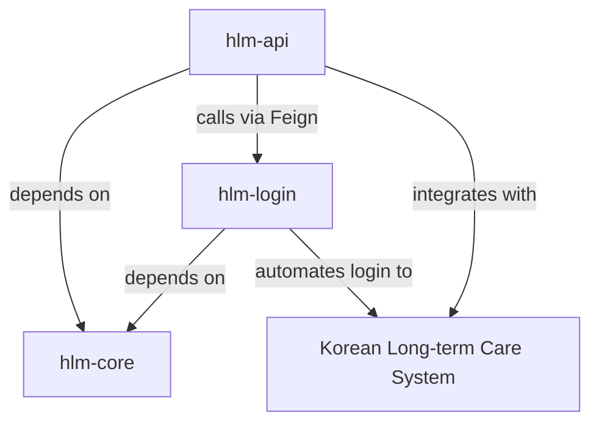
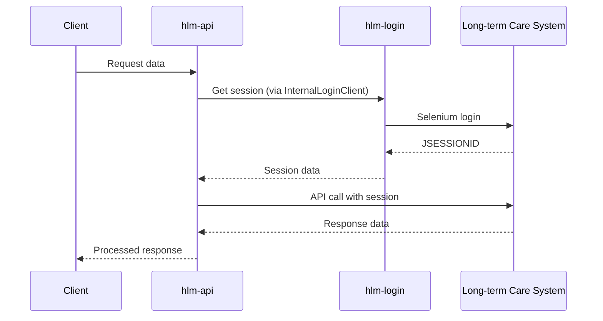
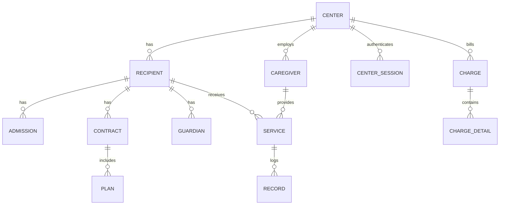

# HIGHCARE-LONGTERM-MODULE Technical Analysis

## Executive Summary

The HIGHCARE-LONGTERM-MODULE is a Spring Boot-based multi-module system designed to integrate with the Korean Long-term Care Insurance (노인장기요양보험) system. It provides automated data synchronization, API access, and browser automation capabilities for long-term care centers.

**Project Wiki**: https://kslab.atlassian.net/wiki/spaces/HLM/overview?homepageId=62193914

---

## Module Overview

### Module Structure

The project is organized as a Gradle multi-module project with the following structure:

```
HIGHCARE-LONGTERM-MODULE/
├── hlm-core/          # Domain entities and shared components
├── hlm-api/           # REST API application
├── hlm-login/         # Selenium-based login automation service
├── database-hlm/      # Database migration scripts
└── code-coverage-report/  # Test coverage reports
```

### Module Relationships



---

## Tech Stack

### Core Technologies

| Component | Technology | Version |
|-----------|-----------|---------|
| Java | OpenJDK | 17 |
| Spring Boot | Spring Boot | 2.6.4 |
| Build Tool | Gradle | (wrapper) |
| Database | MySQL | (via connector) |

### Build Configuration

#### Root Project (build.gradle)

- **Spring Cloud**: 2021.0.1
- **SpringDoc (OpenAPI)**: 1.6.12
- **Selenium**: 4.8.1
- **Java Version**: 17
- **Code Quality**:
  - Checkstyle (Google Code Style)
  - JaCoCo for test coverage (70% minimum target)

---

## Module: hlm-core

### Purpose

Core domain library providing shared entities, DTOs, repositories, and utilities used by both `hlm-api` and `hlm-login`.

### Key Dependencies

| Library | Purpose |
|---------|---------|
| Spring Boot Starter Data JPA | Database access |
| Spring Boot Starter Validation | Bean validation |
| Spring Boot Starter Web | Web components |
| Spring Cloud OpenFeign | External API clients |
| QueryDSL (5.0.0) | Type-safe queries |
| Apache Commons IO | File utilities |
| SpringDoc OpenAPI | API documentation |

### Package Structure

```
com.kslab.hlm.core/
├── constant/       # Application constants
├── domain/
│   ├── dto/       # Data Transfer Objects (78 DTOs)
│   ├── entity/    # JPA Entities (19 entities)
│   └── longterm/  # Long-term care specific models
├── enumeration/   # Enums (16 types)
├── error/         # Error handling
├── exception/     # Custom exceptions
├── feign/         # Feign client interfaces
├── repository/    # JPA repositories (18 repositories)
└── util/          # Utility classes
```

### Domain Entities (19 Total)

#### Core Entities

1. **Center** - Long-term care center
   - Stores encrypted certification credentials
   - Tracks opening/closing dates
   - Uses UUID for external identification

2. **Recipient** - Care recipient (수급자)
   - Long-term care grade (1-5)
   - Contract period tracking
   - Status management (READY, CONTRACTED, END)
   - Charge code classification

3. **Caregiver** - Care provider (요양보호사)

4. **Service** - Care service record

5. **CenterSession** - Authenticated session data

#### Supporting Entities

- **Admission** - Contract admission records
- **Approve** - Approval records
- **Charge** - Billing charges
- **ChargeDetail** - Charge line items
- **Contract** - Service contracts
- **Guardian** - Care recipient guardians
- **Job** - Caregiver job information
- **Manager** - Center managers
- **Plan** - Care plans
- **Record** - Service records
- **Rfid** - RFID device tracking
- **ServiceFee** - Service fees
- **Working** - Work schedules

### Key Enumerations

- `ChargeCodeEnum` - Charge classifications (NORMAL, MEDICAL7D5, BASIC, etc.)
- `RecipientStatusEnum` - Recipient statuses
- `ServiceTypeEnum` - Types of care services
- `VisitTypeEnum` - Visit types (home visit, day care, etc.)
- `GenderEnum`, `RelationEnum`, `TransferEnum`, etc.

### Data Encryption

Entities use `@Convert(converter = EntityConverter.class)` for sensitive data encryption (certification credentials, personal information).

---

## Module: hlm-api

### Purpose

Main REST API application providing:
- External API integration with Korean Long-term Care system
- Data synchronization and management
- Business logic orchestration
- WebSocket support for real-time updates

### Key Dependencies

| Category | Library | Purpose |
|----------|---------|---------|
| **Core** | Spring Boot Starter Web | REST API |
| | Spring Boot Starter Data JPA | Database access |
| | Spring Boot Starter WebSocket | Real-time communication |
| | Spring Boot Starter Actuator | Health monitoring |
| **Database** | MySQL Connector | Database driver |
| **External APIs** | Spring Cloud OpenFeign | HTTP clients |
| | OkHttp3 | HTTP client library |
| **Document Processing** | Apache POI 5.2.1 | Excel generation |
| | iText7, html2pdf | PDF generation |
| | Jsoup | HTML parsing |
| **Cloud** | AWS Secrets Manager | Secrets management |
| | AWS SDK STS | AWS authentication |
| **Security** | Jasypt 3.0.4 | Encryption/decryption |
| **Monitoring** | Slack API Client | Notifications |
| **Retry** | Spring Retry | Resilience |
| **Documentation** | SpringDoc OpenAPI | Swagger UI |

### Application Configuration

#### Server Settings (application.yaml)

```yaml
server:
  port: 7077
  max-http-header-size: 400000
  shutdown: graceful

spring:
  jpa:
    database: mysql
    hibernate:
      ddl-auto: validate
  jackson:
    time-zone: Asia/Seoul
```

#### Health Check Endpoint

```
/monitor/health_check
```

> [!IMPORTANT]
> Default actuator endpoints are changed for security:
> - `/actuator` → `/monitor`
> - `/health` → `/health_check`

#### Swagger Documentation

```
/swagger
```

### Package Structure

```
com.kslab.hlm/
├── HlmApplication.java        # Main application
├── advice/                    # Exception handlers
├── aop/                       # Aspect-oriented programming
├── configuration/             # Spring configurations
├── controller/               # REST controllers (8)
├── dto/                      # DTOs (50)
├── enumeration/              # Enums
├── exception/                # Custom exceptions
├── feign/                    # Feign clients (5 clients)
├── filter/                   # Request/response filters
├── longtermmanager/          # Long-term care business logic
├── model/                    # Request/response models
├── service/                  # Business services (17)
├── sync/                     # Data synchronization
└── util/                     # Utilities
```

### REST Controllers (8)

1. **CenterController** - Center management
2. **CaregiverController** - Caregiver operations
3. **RecipientController** - Recipient management
4. **ServiceController** - Service records
5. **ChargeController** - Billing charges
6. **RecordController** - Care records
7. **RfidController** - RFID device management
8. **DocumentController** - Document generation

### Business Services (17)

Services follow a pattern of API services (external integration) and domain services (business logic):

#### API Services (External Integration)
- `CaregiverApiService` - Caregiver API calls
- `RecipientApiService` - Recipient API calls
- `ServiceApiService` - Service API calls
- `ChargeApiService` - Charge API calls
- `RecordApiService` - Record API calls
- `RfidApiService` - RFID API calls

#### Domain Services
- `CenterService` - Center management
- `CenterInfoService` - Center information
- `CaregiverService` - Caregiver logic
- `RecipientService` - Recipient logic
- `ServiceService` - Service logic
- `ChargeService` - Charge logic
- `RecordService` - Record logic
- `RfidService` - RFID logic

#### Core Services
- **LongtermService** - Main orchestration service for long-term care system integration
- `CenterSessionService` - Session management
- `SlackService` - Notifications

### External Integration (Feign Clients)

#### 1. LongtermXmlClient (40+ endpoints)

Primary client for Korean Long-term Care Insurance system:

**Key Operations:**
- Center information queries
- Caregiver data retrieval
- Recipient management
- Service scheduling
- Charge calculations
- Contract management
- RFID device operations
- Insurance verification

**Sample Methods:**
- `getCenterBasicInformation()` - Center details
- `getCaregiverExcelList()` - Caregiver export
- `getRecipientChargeCode()` - Recipient billing codes
- `getScheduleList()` - Service schedules
- `getRfidDeviceList()` - RFID devices
- `getContractInfoList()` - Contract information

#### 2. InternalLoginClient

Communicates with `hlm-login` service to obtain authenticated sessions.

#### 3. LongtermSsvClient

Server-side validation client for long-term care system.

#### 4. LongtermFormClient

Form submission client.

#### 5. DataGoClient

Integration with Korean government data portal.

### Integration Pattern



### Retry Mechanism

Uses `@Retryable` annotation with custom listener:

```java
@Retryable(
    listeners = "longtermApiRetryListener",
    include = InvalidLongtermSessionException.class
)
```

Automatically retries when session becomes invalid.

### External API Integrations

Configured in `application.yaml`:

| Service | Purpose |
|---------|---------|
| Slack | Notifications |
| Cuttly | URL shortening |
| JP | Address lookup |
| Juso | Address verification (주소) |
| LGU | LGU+ integration |
| Google | Google API services |

---

## Module: hlm-login

### Purpose

Automated browser-based login service using Selenium to:
- Authenticate with Korean Long-term Care Insurance system
- Maintain active sessions for centers
- Provide session credentials to `hlm-api`
- Run scheduled session refresh

### Key Dependencies

| Library | Purpose |
|---------|---------|
| Selenium 4.8.3 | Browser automation |
| Spring Boot Actuator | Health monitoring |
| Spring Cloud OpenFeign | Internal API calls |
| ShedLock | Distributed task locking |
| Spring Retry | Resilience |
| MySQL | Session storage |

### Selenium Components

```
org.seleniumhq.selenium:
- selenium-java
- selenium-chrome-driver
- selenium-chromium-driver
- selenium-devtools-v111
- selenium-remote-driver
- selenium-api
```

### Application Structure

```
com.kslab.hlm.login/
├── HlmLoginApplication.java  # Main application
├── configuration/            # WebDriver, scheduling config
├── controller/              # REST endpoints (3)
├── feign/                   # API clients
└── service/                 # Login services (3)
```

### Main Application

```java
@EnableRetry
@EnableScheduling
@EnableFeignClients
@SpringBootApplication
public class HlmLoginApplication
```

> [!NOTE]
> Key features enabled:
> - `@EnableScheduling` - For automated session refresh
> - `@EnableRetry` - For retry on login failures
> - `@EnableFeignClients` - For calling hlm-api

### Services

#### 1. LoginService

Core login orchestration service.

**Key Methods:**

- `getLoginResult(centerCertId, certKey, certPassword)` - Validate login credentials
- `getSession(Center)` - Get session for a center
- `getSessionFromDb(Center)` - Retrieve cached session
- `updateSession(Center)` - Refresh session for a center
- `updateAllSession()` - **Scheduled task**: Refresh all center sessions

**Session Refresh Logic:**

```java
@Scheduled
public void updateAllSession() {
    List<Center> centers = centerRepository.findAll();
    for (int i = 0; i < MAX_TRY_COUNT; i++) {
        result = loginAllCenters(centers);
        centers = result.retryableCenters();
        successCount += result.successCount();
    }
}
```

Retries up to 3 times for failed centers.

#### 2. SeleniumService

Handles low-level Selenium operations:
- WebDriver initialization
- Browser control
- Certificate handling
- Cookie/session extraction

#### 3. CenterService

Center-related operations.

### Local Development Setup

#### Installing Chromium v111

> [!IMPORTANT]
> Requires Chromium version 111 for compatibility.

**Steps:**

1. Download Chromium:
   - [ARM](https://www.googleapis.com/download/storage/v1/b/chromium-browser-snapshots/o/Mac_Arm%2F1097626%2Fchrome-mac.zip?generation=1674773685855424&alt=media)
   - [Intel](https://www.googleapis.com/download/storage/v1/b/chromium-browser-snapshots/o/Mac%2F1097624%2Fchrome-mac.zip?generation=1674772971409182&alt=media)

2. Extract and move to `/Applications/Chromium.app`

3. Create symbolic link:
   ```bash
   sudo ln -s chromium.wrapper.sh /usr/local/bin/chromium-browser
   ```

4. Download ChromeDriver v111:
   - [ARM](https://chromedriver.storage.googleapis.com/111.0.5563.64/chromedriver_mac_arm64.zip)
   - [Intel](https://chromedriver.storage.googleapis.com/111.0.5563.64/chromedriver_mac64.zip)

5. Move to `/usr/local/bin`:
   ```bash
   sudo mv chromedriver /usr/local/bin
   ```

6. Remove quarantine attributes:
   ```bash
   sudo xattr -cr /Applications/Chromium.app
   sudo xattr -cr /usr/local/bin/chromedriver
   ```

### Distributed Task Locking

Uses **ShedLock** to prevent duplicate scheduled tasks across multiple instances:

```
net.javacrumbs.shedlock:
- shedlock-spring
- shedlock-provider-jdbc-template
```

---

## Application Architecture

### Layered Architecture

```
┌─────────────────────────────────────┐
│       REST Controllers              │ ← User requests
├─────────────────────────────────────┤
│       Service Layer                 │ ← Business logic
│    - Domain Services                │
│    - API Services                   │
├─────────────────────────────────────┤
│    External Integration Layer       │
│    - Feign Clients                  │ → External APIs
│    - Selenium Automation            │ → Browser
├─────────────────────────────────────┤
│       Repository Layer              │ ← Data access
├─────────────────────────────────────┤
│          Database                   │ ← Persistence
└─────────────────────────────────────┘
```

### Data Flow

#### 1. API Request Flow

```
Client → Controller → Service → LongtermService
                                     ↓
                          InternalLoginClient → hlm-login
                                     ↓
                          Get/Refresh Session
                                     ↓
                          LongtermXmlClient → External System
                                     ↓
                          Process & Return
```

#### 2. Scheduled Session Refresh

```
@Scheduled(cron)
      ↓
LoginService.updateAllSession()
      ↓
For each Center:
  SeleniumService.login()
      ↓
  Save to CenterSession
```

### Error Handling

#### Exception Hierarchy

- `BaseException` - Base for all custom exceptions
- `InvalidLongtermSessionException` - Session expired
- `LongtermApiException` - External API errors
- Handled by `@ControllerAdvice`

#### Retry Strategy

```java
@Retryable(
    listeners = "longtermApiRetryListener",
    include = InvalidLongtermSessionException.class
)
```

On session expiration:
1. Catch `InvalidLongtermSessionException`
2. Trigger retry
3. `InternalLoginClient` refreshes session
4. Retry original request

---

## Deployment

### Environment Profiles

- `local` - Local development
- `dev` - Development environment
- `stg` - Staging environment
- `prd` - Production environment

### Docker Support

Both `hlm-api` and `hlm-login` include Dockerfiles for containerized deployment.

### AWS Integration

- **Secrets Manager** - Configuration secrets
- **STS** - Temporary credentials

### Monitoring

#### Actuator Endpoints

```
/monitor/health_check
```

#### Slack Notifications

Configured via `SlackService` for alerting.

---

## Security Features

### Data Encryption

- **Jasypt** for application secrets
- **EntityConverter** for database field encryption
- Encrypted fields: certification credentials, passwords, personal information

### Certificate Management

- Digital certificates stored as encrypted `certKey` in `Center` entity
- Temporary files created during login, then deleted

### Session Security

- Sessions stored with UUID references (not direct IDs)
- JSESSIONID cookies managed securely
- Session refresh on expiration

---

## Testing

### Code Quality Tools

#### Checkstyle

```gradle
checkstyle {
    configFile = file("${rootDir}/tools/code-style/google-check-style.xml")
    toolVersion = "10.3.4"
}
```

Uses Google Java Style Guide.

#### Test Coverage (JaCoCo)

```gradle
jacocoTestCoverageVerification {
    violationRules {
        rule {
            limit {
                minimum = 0.7  // 70% coverage
            }
        }
    }
}
```

Excludes QueryDSL generated Q-classes from coverage.

### Test Frameworks

- JUnit 5 (Platform)
- Mockito (mocking)
- Spring Boot Test

---

## Key Design Patterns

### 1. Multi-Module Architecture

Separation of concerns:
- `hlm-core` - Shared domain
- `hlm-api` - Business API
- `hlm-login` - Infrastructure (authentication)

### 2. Repository Pattern

JPA repositories for data access abstraction.

### 3. Feign Client Pattern

Declarative HTTP clients for external APIs.

### 4. Service-Oriented Architecture

Clear separation:
- **API Services** - External communication
- **Domain Services** - Business logic

### 5. Session Management Pattern

Centralized session handling via `hlm-login` service.

### 6. Retry Pattern

Automatic retry on transient failures using Spring Retry.

---

## Data Model Summary

### Entity Relationships



### Key Relationships

- Center ↔ Recipient: One-to-Many
- Center ↔ Caregiver: One-to-Many
- Recipient ↔ Service: One-to-Many
- Caregiver ↔ Service: One-to-Many
- Recipient ↔ Guardian: One-to-Many

---

## Business Logic Summary

### Core Workflows

#### 1. Center Registration

1. Submit certification credentials
2. Validate via Selenium login
3. Fetch center basic information
4. Store encrypted credentials
5. Initialize session

#### 2. Data Synchronization

1. Retrieve center session
2. Call LongtermXmlClient methods
3. Parse XML/JSON responses
4. Transform to domain entities
5. Persist to database
6. Update sync timestamps

#### 3. Service Management

1. Query schedules via API
2. Record service delivery
3. Track RFID check-in/out
4. Generate service records
5. Calculate billing charges

#### 4. Billing

1. Gather service records
2. Apply charge codes
3. Calculate costs
4. Generate charge details
5. Submit to long-term care system
6. Export to Excel/PDF

---

## External System Integration

### Korean Long-term Care Insurance System

**Official System**: 노인장기요양보험 (Elderly Long-term Care Insurance)

**Integration Methods:**

1. **XML API** - Primary data exchange
   - Form-based submissions
   - XML responses
   - Session-based authentication

2. **SSV (Server-Side Validation)** - Real-time validation

3. **Form Submissions** - Legacy web forms

**Authentication:**
- Certificate-based (공인인증서)
- WebDriver automation for login
- Cookie-based sessions (JSESSIONID)

**Data Types:**
- 센터정보 (Center information)
- 요양보호사 (Caregivers)
- 수급자 (Recipients)
- 급여제공 (Service provision)
- 청구 (Billing)
- RFID 기록 (RFID records)

---

## Conclusion

The HIGHCARE-LONGTERM-MODULE is a sophisticated Spring Boot application designed for:

✅ **Automated Integration** - Seamless connection with Korean Long-term Care system  
✅ **Data Synchronization** - Real-time data exchange and updates  
✅ **Session Management** - Automated login and session refresh  
✅ **Multi-Module Design** - Clean separation of concerns  
✅ **Enterprise Features** - Security, monitoring, retry mechanisms  
✅ **Scalability** - Distributed task locking, stateless design  

### Technology Highlights

- **Spring Boot 2.6.4** with Java 17
- **40+ Feign API endpoints** for external integration
- **Selenium WebDriver** for browser automation
- **QueryDSL** for type-safe queries
- **Jasypt** encryption for sensitive data
- **JaCoCo** and **Checkstyle** for code quality
- **AWS Secrets Manager** for configuration
- **ShedLock** for distributed scheduling

### Key Strengths

1. **Robust Session Management** - Automated refresh with retry
2. **Comprehensive API Coverage** - 40+ endpoints to long-term care system
3. **Clean Architecture** - Multi-module with clear boundaries
4. **Security First** - Encryption, secure sessions, AWS integration
5. **Production Ready** - Health checks, monitoring, logging
