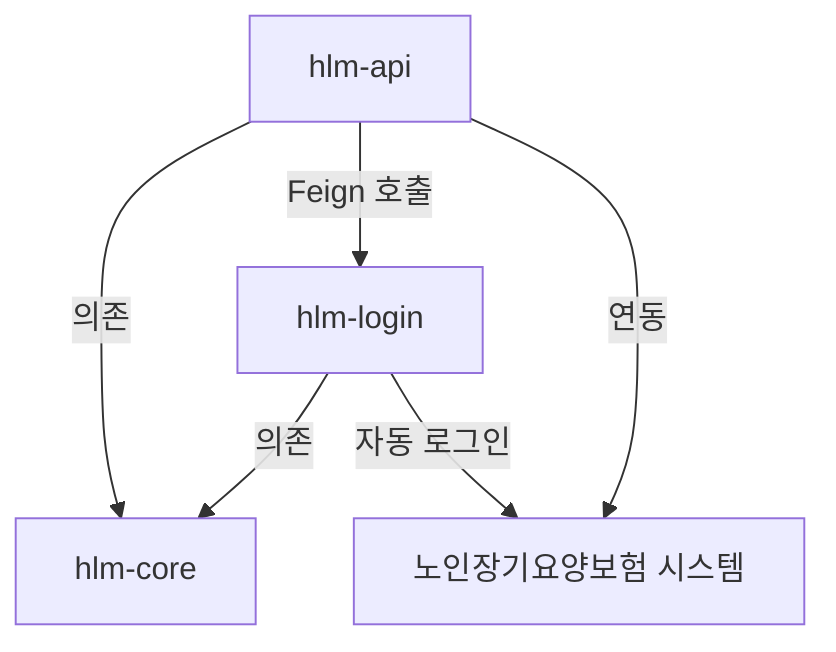
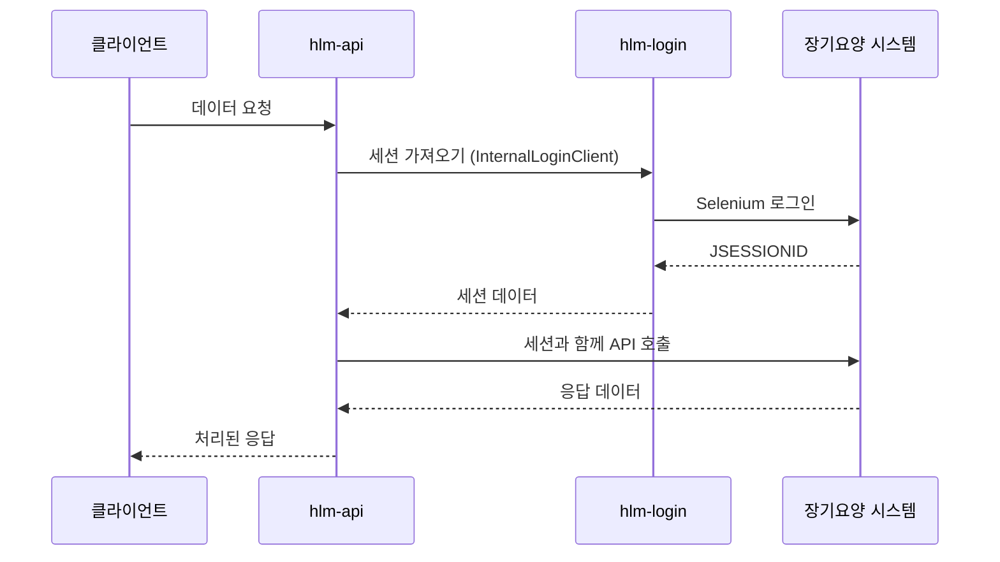
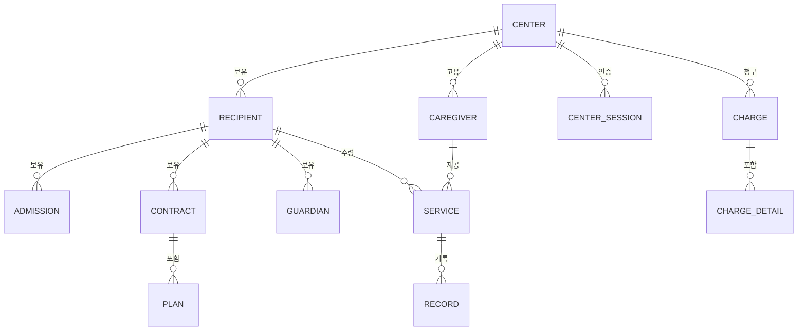

# HIGHCARE-LONGTERM-MODULE 기술 분석 문서

## 개요

HIGHCARE-LONGTERM-MODULE은 한국 노인장기요양보험 시스템과 연동하기 위해 설계된 Spring Boot 기반의 멀티 모듈 시스템입니다. 장기요양기관을 위한 자동화된 데이터 동기화, API 접근, 브라우저 자동화 기능을 제공합니다.

**프로젝트 위키**: https://kslab.atlassian.net/wiki/spaces/HLM/overview?homepageId=62193914

---

## 모듈 개요

### 모듈 구조

프로젝트는 Gradle 멀티 모듈 프로젝트로 구성되어 있습니다:

```
HIGHCARE-LONGTERM-MODULE/
├── hlm-core/          # 도메인 엔티티 및 공유 컴포넌트
├── hlm-api/           # REST API 애플리케이션
├── hlm-login/         # Selenium 기반 로그인 자동화 서비스
├── database-hlm/      # 데이터베이스 마이그레이션 스크립트
└── code-coverage-report/  # 테스트 커버리지 리포트
```

### 모듈 간 관계



---

## 기술 스택

### 핵심 기술

| 구성요소 | 기술 | 버전 |
|---------|------|------|
| Java | OpenJDK | 17 |
| Spring Boot | Spring Boot | 2.6.4 |
| 빌드 도구 | Gradle | (wrapper) |
| 데이터베이스 | MySQL | (connector) |

### 빌드 설정

#### 루트 프로젝트 (build.gradle)

- **Spring Cloud**: 2021.0.1
- **SpringDoc (OpenAPI)**: 1.6.12
- **Selenium**: 4.8.1
- **Java 버전**: 17
- **코드 품질**:
  - Checkstyle (Google Code Style)
  - JaCoCo 테스트 커버리지 (최소 70% 목표)

---

## 모듈: hlm-core

### 목적

`hlm-api`와 `hlm-login`에서 공통으로 사용하는 도메인 엔티티, DTO, 리포지토리, 유틸리티를 제공하는 핵심 도메인 라이브러리입니다.

### 주요 의존성

| 라이브러리 | 용도 |
|-----------|------|
| Spring Boot Starter Data JPA | 데이터베이스 접근 |
| Spring Boot Starter Validation | Bean 검증 |
| Spring Boot Starter Web | 웹 컴포넌트 |
| Spring Cloud OpenFeign | 외부 API 클라이언트 |
| QueryDSL (5.0.0) | 타입 안전 쿼리 |
| Apache Commons IO | 파일 유틸리티 |
| SpringDoc OpenAPI | API 문서화 |

### 패키지 구조

```
com.kslab.hlm.core/
├── constant/       # 애플리케이션 상수
├── domain/
│   ├── dto/       # 데이터 전송 객체 (78개)
│   ├── entity/    # JPA 엔티티 (19개)
│   └── longterm/  # 장기요양 전용 모델
├── enumeration/   # 열거형 (16개)
├── error/         # 에러 처리
├── exception/     # 커스텀 예외
├── feign/         # Feign 클라이언트 인터페이스
├── repository/    # JPA 리포지토리 (18개)
└── util/          # 유틸리티 클래스
```

### 도메인 엔티티 (총 19개)

#### 핵심 엔티티

1. **Center (센터)** - 장기요양기관
   - 암호화된 인증서 정보 저장
   - 개업/폐업 일자 추적
   - 외부 식별을 위한 UUID 사용

2. **Recipient (수급자)** - 요양 수급자
   - 장기요양등급 (1-5등급)
   - 계약 기간 추적
   - 상태 관리 (READY, CONTRACTED, END)
   - 본인부담금 구분 코드

3. **Caregiver (요양보호사)** - 요양 제공자

4. **Service (급여)** - 급여 제공 기록

5. **CenterSession (센터 세션)** - 인증된 세션 데이터

#### 지원 엔티티

- **Admission** - 계약 입소 기록
- **Approve** - 승인 기록
- **Charge** - 청구 비용
- **ChargeDetail** - 청구 상세 항목
- **Contract** - 서비스 계약
- **Guardian** - 수급자 보호자
- **Job** - 요양보호사 직무 정보
- **Manager** - 센터 관리자
- **Plan** - 급여 계획
- **Record** - 서비스 기록
- **Rfid** - RFID 기기 추적
- **ServiceFee** - 서비스 수가
- **Working** - 근무 일정

### 주요 열거형

- `ChargeCodeEnum` - 본인부담금 구분 (일반, 의료7.5%, 기초, 감경7.5%, 감경60%, 감경40%, 의료60%, 미납)
- `RecipientStatusEnum` - 수급자 상태
- `ServiceTypeEnum` - 급여 유형
- `VisitTypeEnum` - 방문 유형 (방문요양, 주야간보호 등)
- `GenderEnum`, `RelationEnum`, `TransferEnum` 등

### 데이터 암호화

민감한 데이터(인증서 정보, 개인정보)는 `@Convert(converter = EntityConverter.class)`를 사용하여 암호화됩니다.

---

## 모듈: hlm-api

### 목적

다음 기능을 제공하는 메인 REST API 애플리케이션:
- 노인장기요양보험 시스템과의 외부 API 연동
- 데이터 동기화 및 관리
- 비즈니스 로직 오케스트레이션
- 실시간 업데이트를 위한 WebSocket 지원

### 주요 의존성

| 카테고리 | 라이브러리 | 용도 |
|---------|-----------|------|
| **핵심** | Spring Boot Starter Web | REST API |
| | Spring Boot Starter Data JPA | 데이터베이스 접근 |
| | Spring Boot Starter WebSocket | 실시간 통신 |
| | Spring Boot Starter Actuator | 헬스 모니터링 |
| **데이터베이스** | MySQL Connector | 데이터베이스 드라이버 |
| **외부 API** | Spring Cloud OpenFeign | HTTP 클라이언트 |
| | OkHttp3 | HTTP 클라이언트 라이브러리 |
| **문서 처리** | Apache POI 5.2.1 | Excel 생성 |
| | iText7, html2pdf | PDF 생성 |
| | Jsoup | HTML 파싱 |
| **클라우드** | AWS Secrets Manager | 시크릿 관리 |
| | AWS SDK STS | AWS 인증 |
| **보안** | Jasypt 3.0.4 | 암복호화 |
| **모니터링** | Slack API Client | 알림 |
| **재시도** | Spring Retry | 복원력 |
| **문서화** | SpringDoc OpenAPI | Swagger UI |

### 애플리케이션 설정

#### 서버 설정 (application.yaml)

```yaml
server:
  port: 7077
  max-http-header-size: 400000
  shutdown: graceful

spring:
  jpa:
    database: mysql
    hibernate:
      ddl-auto: validate
  jackson:
    time-zone: Asia/Seoul
```

#### 헬스 체크 엔드포인트

```
/monitor/health_check
```

> [!IMPORTANT]
> 보안을 위해 기본 actuator 엔드포인트가 변경되었습니다:
> - `/actuator` → `/monitor`
> - `/health` → `/health_check`

#### Swagger 문서

```
/swagger
```

### 패키지 구조

```
com.kslab.hlm/
├── HlmApplication.java        # 메인 애플리케이션
├── advice/                    # 예외 핸들러
├── aop/                       # 관점 지향 프로그래밍
├── configuration/             # Spring 설정
├── controller/               # REST 컨트롤러 (8개)
├── dto/                      # DTO (50개)
├── enumeration/              # 열거형
├── exception/                # 커스텀 예외
├── feign/                    # Feign 클라이언트 (5개)
├── filter/                   # 요청/응답 필터
├── longtermmanager/          # 장기요양 비즈니스 로직
├── model/                    # 요청/응답 모델
├── service/                  # 비즈니스 서비스 (17개)
├── sync/                     # 데이터 동기화
└── util/                     # 유틸리티
```

### REST 컨트롤러 (8개)

1. **CenterController** - 센터 관리
2. **CaregiverController** - 요양보호사 운영
3. **RecipientController** - 수급자 관리
4. **ServiceController** - 급여 기록
5. **ChargeController** - 청구 비용
6. **RecordController** - 급여 기록
7. **RfidController** - RFID 기기 관리
8. **DocumentController** - 문서 생성

### 비즈니스 서비스 (17개)

서비스는 API 서비스(외부 연동)와 도메인 서비스(비즈니스 로직)로 구분됩니다:

#### API 서비스 (외부 통신)
- `CaregiverApiService` - 요양보호사 API 호출
- `RecipientApiService` - 수급자 API 호출
- `ServiceApiService` - 급여 API 호출
- `ChargeApiService` - 청구 API 호출
- `RecordApiService` - 기록 API 호출
- `RfidApiService` - RFID API 호출

#### 도메인 서비스
- `CenterService` - 센터 관리
- `CenterInfoService` - 센터 정보
- `CaregiverService` - 요양보호사 로직
- `RecipientService` - 수급자 로직
- `ServiceService` - 급여 로직
- `ChargeService` - 청구 로직
- `RecordService` - 기록 로직
- `RfidService` - RFID 로직

#### 핵심 서비스
- **LongtermService** - 장기요양 시스템 연동을 위한 메인 오케스트레이션 서비스
- `CenterSessionService` - 세션 관리
- `SlackService` - 알림

### 외부 연동 (Feign 클라이언트)

#### 1. LongtermXmlClient (40+ 엔드포인트)

노인장기요양보험 시스템을 위한 주요 클라이언트:

**주요 기능:**
- 센터 정보 조회
- 요양보호사 데이터 조회
- 수급자 관리
- 급여 일정 관리
- 청구 계산
- 계약 관리
- RFID 기기 운영
- 보험 검증

**주요 메서드:**
- `getCenterBasicInformation()` - 센터 상세 정보
- `getCaregiverExcelList()` - 요양보호사 엑셀 내보내기
- `getRecipientChargeCode()` - 수급자 본인부담금 코드
- `getScheduleList()` - 급여 일정
- `getRfidDeviceList()` - RFID 기기
- `getContractInfoList()` - 계약 정보

#### 2. InternalLoginClient

인증된 세션을 얻기 위해 `hlm-login` 서비스와 통신합니다.

#### 3. LongtermSsvClient

장기요양 시스템을 위한 서버 측 검증 클라이언트.

#### 4. LongtermFormClient

폼 제출 클라이언트.

#### 5. DataGoClient

한국 정부 데이터 포털과의 연동.

### 연동 패턴



### 재시도 메커니즘

커스텀 리스너와 함께 `@Retryable` 어노테이션 사용:

```java
@Retryable(
    listeners = "longtermApiRetryListener",
    include = InvalidLongtermSessionException.class
)
```

세션이 무효화되면 자동으로 재시도합니다.

### 외부 API 연동

`application.yaml`에 설정:

| 서비스 | 용도 |
|--------|------|
| Slack | 알림 |
| Cuttly | URL 단축 |
| JP | 주소 조회 |
| Juso | 주소 검증 |
| LGU | LGU+ 연동 |
| Google | Google API 서비스 |

---

## 모듈: hlm-login

### 목적

Selenium을 사용한 자동화된 브라우저 기반 로그인 서비스:
- 노인장기요양보험 시스템 인증
- 센터의 활성 세션 유지
- `hlm-api`에 세션 자격 증명 제공
- 예약된 세션 갱신 실행

### 주요 의존성

| 라이브러리 | 용도 |
|-----------|------|
| Selenium 4.8.3 | 브라우저 자동화 |
| Spring Boot Actuator | 헬스 모니터링 |
| Spring Cloud OpenFeign | 내부 API 호출 |
| ShedLock | 분산 작업 잠금 |
| Spring Retry | 복원력 |
| MySQL | 세션 저장 |

### Selenium 컴포넌트

```
org.seleniumhq.selenium:
- selenium-java
- selenium-chrome-driver
- selenium-chromium-driver
- selenium-devtools-v111
- selenium-remote-driver
- selenium-api
```

### 애플리케이션 구조

```
com.kslab.hlm.login/
├── HlmLoginApplication.java  # 메인 애플리케이션
├── configuration/            # WebDriver, 스케줄링 설정
├── controller/              # REST 엔드포인트 (3개)
├── feign/                   # API 클라이언트
└── service/                 # 로그인 서비스 (3개)
```

### 메인 애플리케이션

```java
@EnableRetry
@EnableScheduling
@EnableFeignClients
@SpringBootApplication
public class HlmLoginApplication
```

> [!NOTE]
> 활성화된 주요 기능:
> - `@EnableScheduling` - 자동 세션 갱신용
> - `@EnableRetry` - 로그인 실패 시 재시도
> - `@EnableFeignClients` - hlm-api 호출용

### 서비스

#### 1. LoginService

핵심 로그인 오케스트레이션 서비스.

**주요 메서드:**

- `getLoginResult(centerCertId, certKey, certPassword)` - 로그인 자격 증명 검증
- `getSession(Center)` - 센터의 세션 가져오기
- `getSessionFromDb(Center)` - 캐시된 세션 조회
- `updateSession(Center)` - 센터의 세션 갱신
- `updateAllSession()` - **예약된 작업**: 모든 센터 세션 갱신

**세션 갱신 로직:**

```java
@Scheduled
public void updateAllSession() {
    List<Center> centers = centerRepository.findAll();
    for (int i = 0; i < MAX_TRY_COUNT; i++) {
        result = loginAllCenters(centers);
        centers = result.retryableCenters();
        successCount += result.successCount();
    }
}
```

실패한 센터에 대해 최대 3회까지 재시도합니다.

#### 2. SeleniumService

저수준 Selenium 작업 처리:
- WebDriver 초기화
- 브라우저 제어
- 인증서 처리
- 쿠키/세션 추출

#### 3. CenterService

센터 관련 작업.

### 로컬 개발 환경 설정

README.md에서:

#### Chromium v111 설치

> [!IMPORTANT]
> 호환성을 위해 Chromium 버전 111이 필요합니다.

**단계:**

1. Chromium 다운로드:
   - [ARM](https://www.googleapis.com/download/storage/v1/b/chromium-browser-snapshots/o/Mac_Arm%2F1097626%2Fchrome-mac.zip?generation=1674773685855424&alt=media)
   - [Intel](https://www.googleapis.com/download/storage/v1/b/chromium-browser-snapshots/o/Mac%2F1097624%2Fchrome-mac.zip?generation=1674772971409182&alt=media)

2. 압축 해제 후 `/Applications/Chromium.app`로 이동

3. 심볼릭 링크 생성:
   ```bash
   sudo ln -s chromium.wrapper.sh /usr/local/bin/chromium-browser
   ```

4. ChromeDriver v111 다운로드:
   - [ARM](https://chromedriver.storage.googleapis.com/111.0.5563.64/chromedriver_mac_arm64.zip)
   - [Intel](https://chromedriver.storage.googleapis.com/111.0.5563.64/chromedriver_mac64.zip)

5. `/usr/local/bin`으로 이동:
   ```bash
   sudo mv chromedriver /usr/local/bin
   ```

6. 격리 속성 제거:
   ```bash
   sudo xattr -cr /Applications/Chromium.app
   sudo xattr -cr /usr/local/bin/chromedriver
   ```

### 분산 작업 잠금

여러 인스턴스에서 중복 예약 작업을 방지하기 위해 **ShedLock** 사용:

```
net.javacrumbs.shedlock:
- shedlock-spring
- shedlock-provider-jdbc-template
```

---

## 애플리케이션 아키텍처

### 계층형 아키텍처

```
┌─────────────────────────────────────┐
│       REST 컨트롤러                  │ ← 사용자 요청
├─────────────────────────────────────┤
│       서비스 계층                    │ ← 비즈니스 로직
│    - 도메인 서비스                   │
│    - API 서비스                      │
├─────────────────────────────────────┤
│    외부 연동 계층                    │
│    - Feign 클라이언트                │ → 외부 API
│    - Selenium 자동화                 │ → 브라우저
├─────────────────────────────────────┤
│       리포지토리 계층                │ ← 데이터 접근
├─────────────────────────────────────┤
│          데이터베이스                │ ← 영속성
└─────────────────────────────────────┘
```

### 데이터 흐름

#### 1. API 요청 흐름

```
클라이언트 → 컨트롤러 → 서비스 → LongtermService
                                     ↓
                          InternalLoginClient → hlm-login
                                     ↓
                          세션 가져오기/갱신
                                     ↓
                          LongtermXmlClient → 외부 시스템
                                     ↓
                          처리 및 반환
```

#### 2. 예약된 세션 갱신

```
@Scheduled(cron)
      ↓
LoginService.updateAllSession()
      ↓
각 센터에 대해:
  SeleniumService.login()
      ↓
  CenterSession에 저장
```

### 에러 처리

#### 예외 계층 구조

- `BaseException` - 모든 커스텀 예외의 기본 클래스
- `InvalidLongtermSessionException` - 세션 만료
- `LongtermApiException` - 외부 API 오류
- `@ControllerAdvice`로 처리

#### 재시도 전략

```java
@Retryable(
    listeners = "longtermApiRetryListener",
    include = InvalidLongtermSessionException.class
)
```

세션 만료 시:
1. `InvalidLongtermSessionException` 포착
2. 재시도 트리거
3. `InternalLoginClient`가 세션 갱신
4. 원래 요청 재시도

---

## 배포

### 환경 프로파일

- `local` - 로컬 개발
- `dev` - 개발 환경
- `stg` - 스테이징 환경
- `prd` - 프로덕션 환경

### Docker 지원

`hlm-api`와 `hlm-login` 모두 컨테이너화된 배포를 위한 Dockerfile을 포함합니다.

### AWS 연동

- **Secrets Manager** - 설정 시크릿
- **STS** - 임시 자격 증명

### 모니터링

#### Actuator 엔드포인트

```
/monitor/health_check
```

#### Slack 알림

알림을 위해 `SlackService`를 통해 설정됩니다.

---

## 보안 기능

### 데이터 암호화

- 애플리케이션 시크릿을 위한 **Jasypt**
- 데이터베이스 필드 암호화를 위한 **EntityConverter**
- 암호화된 필드: 인증서 정보, 비밀번호, 개인정보

### 인증서 관리

- 디지털 인증서는 `Center` 엔티티에 암호화된 `certKey`로 저장
- 로그인 중 임시 파일 생성 후 삭제

### 세션 보안

- UUID 참조로 세션 저장 (직접 ID 아님)
- JSESSIONID 쿠키를 안전하게 관리
- 만료 시 세션 갱신

---

## 테스트

### 코드 품질 도구

#### Checkstyle

```gradle
checkstyle {
    configFile = file("${rootDir}/tools/code-style/google-check-style.xml")
    toolVersion = "10.3.4"
}
```

Google Java 스타일 가이드 사용.

#### 테스트 커버리지 (JaCoCo)

```gradle
jacocoTestCoverageVerification {
    violationRules {
        rule {
            limit {
                minimum = 0.7  // 70% 커버리지
            }
        }
    }
}
```

QueryDSL로 생성된 Q-클래스는 커버리지에서 제외됩니다.

### 테스트 프레임워크

- JUnit 5 (Platform)
- Mockito (모킹)
- Spring Boot Test

---

## 주요 디자인 패턴

### 1. 멀티 모듈 아키텍처

관심사 분리:
- `hlm-core` - 공유 도메인
- `hlm-api` - 비즈니스 API
- `hlm-login` - 인프라 (인증)

### 2. 리포지토리 패턴

데이터 접근 추상화를 위한 JPA 리포지토리.

### 3. Feign 클라이언트 패턴

외부 API를 위한 선언적 HTTP 클라이언트.

### 4. 서비스 지향 아키텍처

명확한 분리:
- **API 서비스** - 외부 통신
- **도메인 서비스** - 비즈니스 로직

### 5. 세션 관리 패턴

`hlm-login` 서비스를 통한 중앙 집중식 세션 처리.

### 6. 재시도 패턴

Spring Retry를 사용한 일시적 장애에 대한 자동 재시도.

---

## 데이터 모델 요약

### 엔티티 관계



### 주요 관계

- 센터 ↔ 수급자: 일대다
- 센터 ↔ 요양보호사: 일대다
- 수급자 ↔ 급여: 일대다
- 요양보호사 ↔ 급여: 일대다
- 수급자 ↔ 보호자: 일대다

---

## 비즈니스 로직 요약

### 핵심 워크플로우

#### 1. 센터 등록

1. 인증서 정보 제출
2. Selenium 로그인으로 검증
3. 센터 기본 정보 가져오기
4. 암호화된 자격 증명 저장
5. 세션 초기화

#### 2. 데이터 동기화

1. 센터 세션 조회
2. LongtermXmlClient 메서드 호출
3. XML/JSON 응답 파싱
4. 도메인 엔티티로 변환
5. 데이터베이스에 저장
6. 동기화 타임스탬프 업데이트

#### 3. 급여 관리

1. API를 통해 일정 조회
2. 급여 제공 기록
3. RFID 체크인/아웃 추적
4. 급여 기록 생성
5. 청구 비용 계산

#### 4. 청구

1. 급여 기록 수집
2. 본인부담금 코드 적용
3. 비용 계산
4. 청구 상세 생성
5. 장기요양 시스템에 제출
6. Excel/PDF로 내보내기

---

## 외부 시스템 연동

### 노인장기요양보험 시스템

**공식 시스템**: 노인장기요양보험 (Elderly Long-term Care Insurance)

**연동 방법:**

1. **XML API** - 주요 데이터 교환
   - 폼 기반 제출
   - XML 응답
   - 세션 기반 인증

2. **SSV (Server-Side Validation)** - 실시간 검증

3. **폼 제출** - 레거시 웹 폼

**인증:**
- 인증서 기반 (공인인증서)
- 로그인을 위한 WebDriver 자동화
- 쿠키 기반 세션 (JSESSIONID)

**데이터 유형:**
- 센터정보 (Center information)
- 요양보호사 (Caregivers)
- 수급자 (Recipients)
- 급여제공 (Service provision)
- 청구 (Billing)
- RFID 기록 (RFID records)

---

## 결론

HIGHCARE-LONGTERM-MODULE은 다음을 위해 설계된 정교한 Spring Boot 애플리케이션입니다:

✅ **자동화된 연동** - 노인장기요양보험 시스템과의 원활한 연결  
✅ **데이터 동기화** - 실시간 데이터 교환 및 업데이트  
✅ **세션 관리** - 자동 로그인 및 세션 갱신  
✅ **멀티 모듈 설계** - 명확한 관심사 분리  
✅ **엔터프라이즈 기능** - 보안, 모니터링, 재시도 메커니즘  
✅ **확장성** - 분산 작업 잠금, 무상태 설계  

### 기술 하이라이트

- **Spring Boot 2.6.4** with Java 17
- **40+ Feign API 엔드포인트** 외부 연동용
- **Selenium WebDriver** 브라우저 자동화용
- **QueryDSL** 타입 안전 쿼리용
- **Jasypt** 민감 데이터 암호화용
- **JaCoCo** 및 **Checkstyle** 코드 품질용
- **AWS Secrets Manager** 설정용
- **ShedLock** 분산 스케줄링용

### 주요 강점

1. **강력한 세션 관리** - 재시도를 통한 자동 갱신
2. **포괄적인 API 커버리지** - 장기요양 시스템에 대한 40+ 엔드포인트
3. **깔끔한 아키텍처** - 명확한 경계를 가진 멀티 모듈
4. **보안 우선** - 암호화, 안전한 세션, AWS 연동
5. **프로덕션 준비** - 헬스 체크, 모니터링, 로깅
