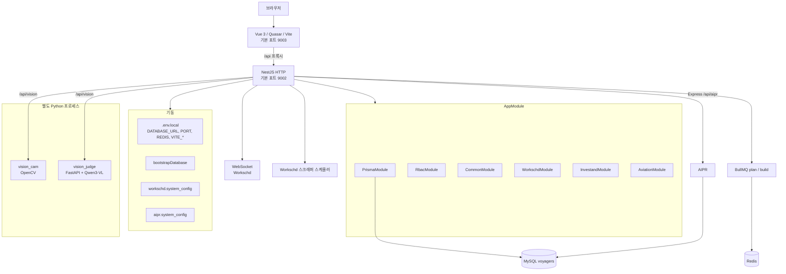
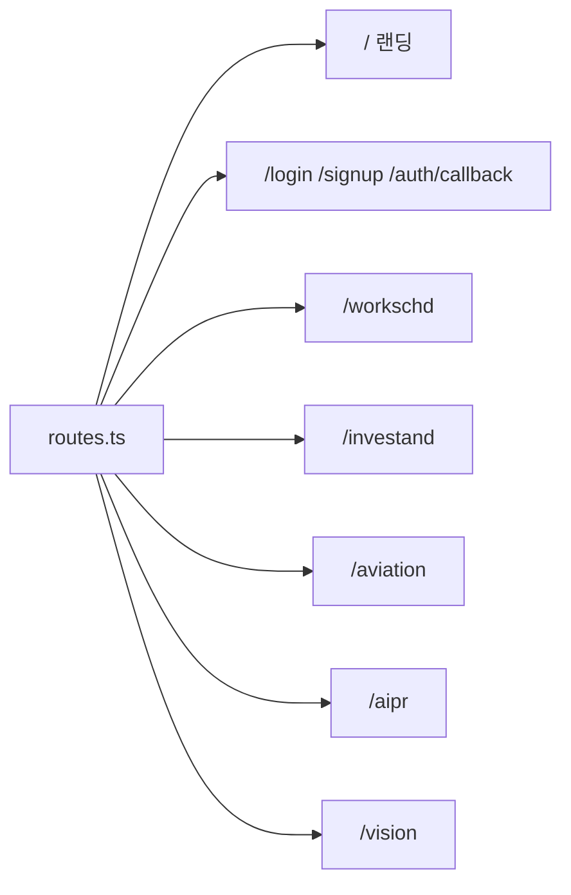
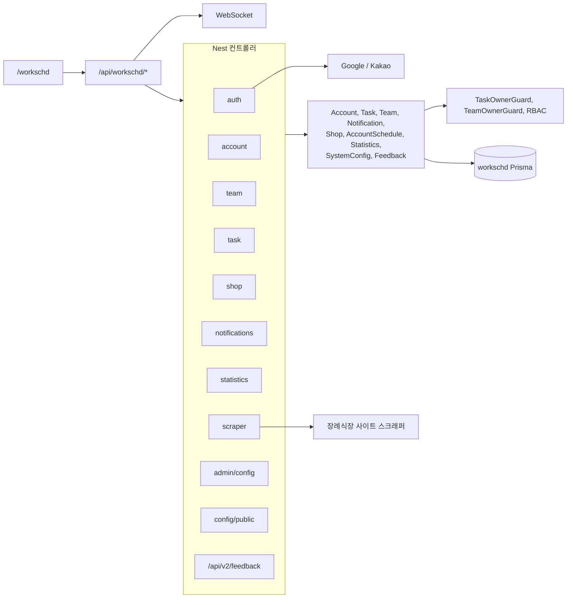
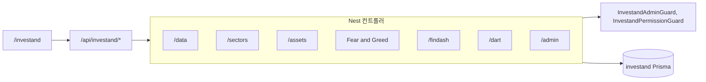
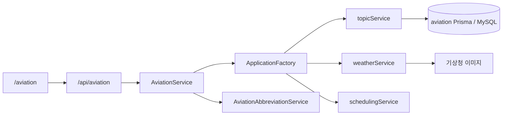
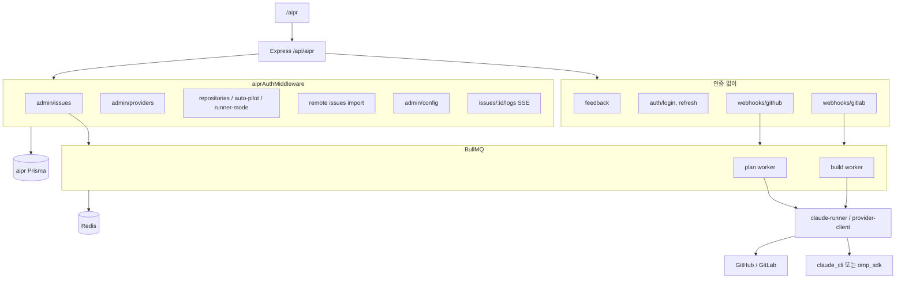
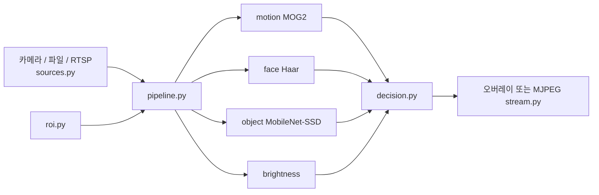
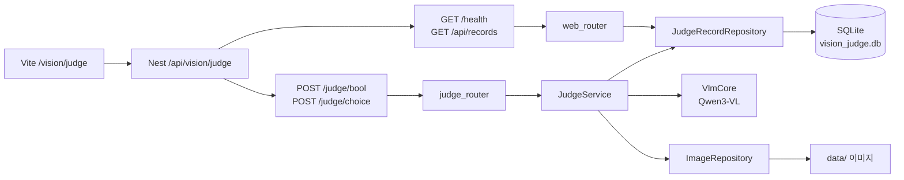

# Voyagerss 아키텍처

모노레포의 런타임 구성입니다. 화면은 `frontend/`, API는 `backend/`입니다. Python 패키지 `vision_cam/`(OpenCV 카메라)과 `vision_judge/`(Qwen3-VL 이미지 판단)는 별도 프로세스입니다. Nest `/api/vision`이 구성·테스트 콘솔용으로 두 프로세스에 프록시합니다.

관련 문서: [setup.md](setup.md), [multi_schema_guide.md](guides/multi_schema_guide.md), 모듈 PRD는 [prd/](prd/).

## 전체 구성

로컬 개발은 저장소 루트에서 `pnpm dev`입니다. Nest, Vite, vision_cam, vision_judge가 함께 뜹니다. `pnpm dev:be`, `pnpm dev:fe`, `pnpm dev:vision`으로 나눠 띄울 수도 있습니다.

## 프론트엔드

| 항목 | 위치 |
|------|------|
| 엔트리 | `frontend/src/main.ts` |
| 라우터 | `frontend/src/router/routes.ts` |
| 권한 | `frontend/src/router/permission.ts`, `route-access.ts` |
| 모듈 화면 | `frontend/src/modules/{workschd,investand,aviation,aipr}` |
| 공통 화면 | `frontend/src/views/common`, `Landing.vue` |
| 상태 | Pinia |
| UI | Quasar |

모듈 라우트는 각 `modules/*/router/routes.ts`에서 모여 `MainLayout` 아래 `RouteView`로 렌더됩니다. 문서 제목은 라우트 `meta`에서 설정합니다.

`frontend/public/aipr/embed.js`가 있어, 개발 서버에서 `/aipr` 문서 요청은 정적 디렉터리와 경로가 겹칩니다. `/aipr/issues` 같은 하위 경로는 SPA로 열립니다.

## 백엔드 기동

`backend/src/main.ts` 순서입니다.

1. `bootstrapDatabase`: workschd Prisma migrate, AIPR SQL 패치, system_config 시드
2. Nest `AppModule` 생성
3. `configService`, `aiprConfigService`로 DB 설정 캐시
4. CORS, Helmet, ValidationPipe
5. `GET /health`
6. Express 라우터를 `/api/aipr`에 마운트
7. Nest 전역 prefix `api`
8. Workschd WebSocket, 스크래퍼 스케줄러, AIPR BullMQ 워커
9. `BACKEND_PORT`(로컬 기본 9002)에서 listen

부트 전에 필요한 값은 `.env.local`입니다. JWT, OAuth, API 키, CORS 허용 출처는 DB `system_config`입니다. 자세한 구분은 [setup.md](setup.md)의 Boot env vs DB config를 봅니다.

## 데이터

하나의 MySQL 데이터베이스에 Prisma 클라이언트 다섯 개가 붙습니다. `PrismaModule`은 `@Global()`이라 Nest 모듈에서 주입할 수 있습니다.

| 클라이언트 | 스키마 파일 | 사용처 |
|------------|-------------|--------|
| `@prisma/client-workschd` | `backend/prisma/workschd.prisma` | Workschd, 공유 system_config |
| `@prisma/client-investand` | `backend/prisma/investand.prisma` | Investand |
| `@prisma/client-aviation` | `backend/prisma/aviation.prisma` | Aviation 기능의 MySQL 저장소 |
| `@prisma/client-aipr` | `backend/prisma/aipr.prisma` | AIPR |
| `@prisma/client-rbac` | `backend/prisma/rbac.prisma` | 권한 동기화, RBAC 관리 API |

AIPR 워커 큐는 Redis(BullMQ)를 사용합니다. 기본 호스트는 `REDIS_HOST` / `REDIS_PORT`입니다.

## Workschd

장례식장 근무 일정, 팀, 알림, 빈소 스크래퍼입니다. Nest `WorkschdModule`입니다.

화면: 홈, 팀 가입/관리, 업무 관리(데스크톱·모바일), 빈소 현황, 관리자 대시보드, RBAC(역할, 권한, 역할-권한, 주체).

## Investand

시장 데이터, 섹터, 글로벌 자산, Fear and Greed, DART입니다. Nest `InvestandModule`이고 `RbacModule`을 가져옵니다.

화면: 홈, Market Lab, 섹터, 글로벌 자산, DART, BOK, 설정, 관리자(대시보드, DART, Fear and Greed).

## Aviation

Nest에는 `AviationNestController`와 `AviationService`만 있습니다. 서비스가 `ApplicationFactory`로 기존 JS 기능을 띄웁니다.

`features/` 아래에는 퀴즈, 공항 내비게이션, 날씨, 스케줄, 사용자, 메시징이 있습니다. HTTP로 노출되는 범위는 컨트롤러 기준입니다. 지식/토픽, 날씨 수집, 약어 조회·방송입니다.

화면: 대시보드, 토픽, 날씨, 백업.

## AIPR

이슈를 가져와 계획과 빌드를 돌리고 PR로 잇는 모듈입니다. Nest `AppModule`에 없고, `main.ts`가 Express 라우터를 `/api/aipr`에 붙입니다. 워커는 같은 프로세스에서 `initWorkers()`로 시작합니다.

에이전트 구현은 `backend/src/modules/aipr/agent/`입니다. 설정 키 `AIPR_AGENT_PROVIDER`가 `claude_cli`(기본) 또는 `omp_sdk`를 고릅니다. OMP는 Bun 브리지를 통해 로컬 모델로 나갈 수 있습니다. 절차는 [aipr-local-mlx.md](guides/aipr-local-mlx.md)에 있습니다.

`AgentController` 클래스는 있으나 `routes.ts`에 등록되어 있지 않습니다. 계획/빌드 진입은 워커입니다.

화면: 홈, 이슈, 이슈 상세, 저장소, 저장소별 이슈, 프로바이더, 설정, 위젯. 이슈 등 보호 라우트는 로그인 전 401로 갑니다.

## vision_cam

`vision_cam/`은 맥에서 개발하고 라즈베리파이로 옮기는 OpenCV 실시간 카메라 모듈입니다. 파이프라인은 CLI로 기동하고, Vue `/vision/cam`은 Nest가 `GET /status`와 MJPEG `/stream.mjpg`를 프록시한 화면입니다. 분석기·ROI·decision 규칙은 프로세스 시작 시에만 바뀝니다.

패키지 경로는 `vision_cam/vision_cam/`입니다. 판단과 출력값이 분리되어 있습니다. `STOP`은 속도와 조향을 즉시 0으로 둡니다. `SLOW`와 `GO`는 프레임마다 `accel_step`, `decel_step`, `steer_step`만큼만 목표로 이동합니다. 진입점은 `python -m vision_cam`입니다. 설명은 [vision_cam/README.md](../../vision_cam/README.md)에 있습니다.

## vision_judge

`vision_judge/`는 Qwen3-VL logit으로 이미지를 판단하는 FastAPI 서버입니다. 텍스트를 생성하지 않고 선택지 토큰 확률만 계산합니다. 이력은 SQLite, 업로드 이미지는 로컬 디렉터리에 둡니다. Vue `/vision/judge`는 Nest를 통해 health, bool/choice, JSON 이력, 이미지를 테스트합니다.

앱 진입은 `vision_judge.main`입니다. 모델은 프로세스 시작 시 한 번 로드되고, device는 cuda, mps, cpu 순으로 고릅니다. 기본 포트는 8000입니다. 설명은 [vision_judge/README.md](../../vision_judge/README.md)에 있습니다.

## 공통 모듈

| 모듈 | 역할 |
|------|------|
| `AppConfigModule` | DB 설정 서비스, 시드, 암호화 키 |
| `CommonModule` | `/api/common` (예: `sys-i18n`) |
| `RbacModule` | 선언된 권한 동기화, `/api/rbac` 관리 API |
| Workschd WebSocket | Nest HTTP 서버에 붙는 실시간 채널 |
| Workschd scraper scheduler | 프로세스 기동 시 빈소 수집 스케줄 |

## 로컬 포트

| 프로세스 | 기본 포트 | 설정 |
|----------|-----------|------|
| Backend | 9002 | `BACKEND_PORT` |
| Frontend | 9003 | `FRONTEND_PORT` |
| vision_cam MJPEG | 실행 시 지정 | `python -m vision_cam --stream` |
| vision_judge | 8000 | `PORT`, `./run.sh` |
| Redis | 6379 | `REDIS_PORT` |
| MySQL | 3306 | `DATABASE_URL` |
