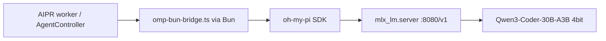

# AIPR 로컬 MLX + oh-my-pi 가이드

Apple Silicon Mac에서 **완전 로컬** coding LLM으로 Auto-PR(AIPR) agent를 실행하는 방법입니다.

> **MLX 스크립트·모델·Open WebUI**는 Voyagerss 밖 [`~/repository/local-llm`](../../../local-llm/)에서 관리합니다.
>
> - 설치: [`local-llm/mlx/setup.sh`](../../../local-llm/mlx/setup.sh) (`VOYAGERSS_ROOT` 자동 감지)
> - 상세: [`local-llm/docs/aipr-integration.md`](../../../local-llm/docs/aipr-integration.md)
> - 채팅 UI: [`local-llm/docs/openwebui-mlx.md`](../../../local-llm/docs/openwebui-mlx.md)

## 아키텍처



| 구성요소 | 역할 |
|----------|------|
| **local-llm** | MLX 서버, 모델 프로필, OMP 설정 |
| **oh-my-pi** | 코딩 agent SDK (Bun 런타임) |
| **AIPR `omp_sdk`** | `omp-runner.ts` → Bun bridge → OMP 세션 |

## 모델 (coding 프로필)

| 항목 | 값 |
|------|-----|
| 프로필 | `coding` (`MLX_PROFILE=coding`) |
| 캐시 | `~/.cache/mlx-models/Qwen3-Coder-30B-A3B-Instruct-4bit` |
| OMP 모델 ID | `mlx-local/qwen3-coder-local` |

## 최초 설치 (1회)

```bash
cd ~/repository/local-llm
chmod +x mlx/*.sh openwebui/*.sh
VOYAGERSS_ROOT=~/repository/voyagerss ./mlx/setup.sh
```

## 일일 사용

```bash
# MLX (coding — AIPR 필수)
cd ~/repository/local-llm
MLX_PROFILE=coding ./mlx/start-server.sh
./mlx/status.sh

# Voyagerss 백엔드
cd ~/repository/voyagerss/backend && npm run dev

# 종료
~/repository/local-llm/mlx/stop-server.sh
```

## AIPR 환경 변수

`.env.local`:

```env
AIPR_AGENT_PROVIDER=omp_sdk
AIPR_OMP_MODEL=mlx-local/qwen3-coder-local
AIPR_OMP_THINKING_LEVEL=off
AIPR_OMP_MAX_TURNS=40
```

## 연결 테스트

```http
POST /aipr/agent/test-provider
Content-Type: application/json

{ "provider": "omp_sdk" }
```

## 소스 코드 (Voyagerss)

| 파일 | 설명 |
|------|------|
| `backend/src/modules/aipr/agent/omp-runner.ts` | Node → Bun bridge |
| `backend/src/modules/aipr/agent/omp-bun-bridge.ts` | Bun에서 OMP SDK 실행 |
| `backend/src/modules/aipr/controllers/AgentController.ts` | provider 테스트 API |
| `~/.omp/agent/models.json` | `local-llm/mlx/configure-omp.sh`로 생성 |

## 트러블슈팅

| 증상 | 해결 |
|------|------|
| `API: DOWN` | `MLX_PROFILE=coding ~/repository/local-llm/mlx/start-server.sh` |
| `No OMP models available` | `MLX_PROFILE=coding ~/repository/local-llm/mlx/configure-omp.sh` |
| 메모리 부족 | `start-server.sh`가 Ollama를 먼저 종료함 |

## 관련 문서

- [local-llm/docs/openwebui-mlx.md](../../../local-llm/docs/openwebui-mlx.md)
- [setup.md](../setup.md)
- [PRD-aipr.md](../prd/PRD-aipr.md)
