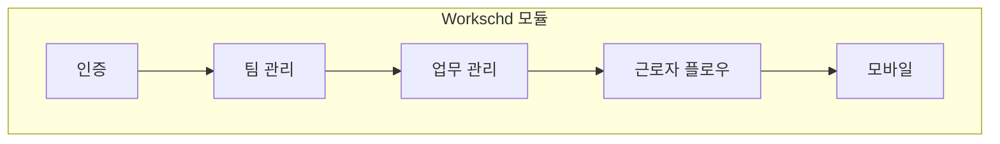

# 통합 테스트 계획 개요

**버전**: 1.2  
**작성일**: 2026-01-18  
**테스트 범위**: 사용자 관점 순차 통합 테스트

---

## 개요

본 문서는 Voyagerss 애플리케이션 모듈별 통합 테스트 계획의 인덱스 역할을 합니다. 각 모듈은 별도의 상세 테스트 계획 문서를 보유하고 있습니다.

## 테스트 계획 문서

| 모듈 | 문서 | 설명 |
|------|------|------|
| **Workschd** | [workschd-test-plan.md](./workschd-test-plan.md) | 근무 일정 관리, 팀/업무 관리, 근로자 플로우 |

---

## 전체 테스트 흐름



---

## 빠른 참조

### Workschd 모듈 테스트
- **인증**: 로그인, OAuth (Google/Kakao), 회원가입, 로그아웃
- **팀 관리**: 등록, 멤버, 매장, 초대 링크, 승인
- **업무 관리**: CRUD, 캘린더 뷰, 드래그 앤 드롭, 템플릿
- **근로자 플로우**: 참여 신청, 승인/거절, 출근/퇴근
- **모바일 뷰**: 업무 목록 모바일, 업무 관리 모바일, 반응형
- **알림**: 로드, 읽지 않은 수, 읽음 처리
- **통계**: 대시보드, 팀, 근로자

---

## 테스트 우선순위 요약

### P0 (핵심 경로) - 필수 통과
| 카테고리 | 개수 | 설명 |
|----------|------|------|
| Workschd | 18 | 인증, 팀/업무 CRUD, 참여 신청, 출퇴근 |

### P1 (중요 기능)
| 카테고리 | 개수 | 설명 |
|----------|------|------|
| Workschd | 22 | 캘린더, 모바일 뷰, 알림 |

### P2-P3 (경계 케이스)
| 카테고리 | 개수 | 설명 |
|----------|------|------|
| Workschd | 12 | 경계 케이스, 고급 기능 |

---

## 테스트 환경

### 공통 요구사항
- Node.js 18+
- PostgreSQL 데이터베이스 구성
- 환경 변수 설정

### URL
- 프론트엔드: `http://localhost:9003`
- 백엔드: `http://localhost:9002`

### 모듈별 요구사항

**Workschd:**
- OAuth 인증 정보 (Google, Kakao)
- 테스트 사용자 계정 (관리자, 매니저, 근로자 역할)

---

## 테스트 실행

```bash
# 백엔드 전체 테스트
cd backend
npm run test

# 프론트엔드 전체 테스트
cd frontend
npm run test

# 특정 모듈 테스트
npm run test -- --grep "workschd"
```

---

## 버전 이력

| 버전 | 날짜 | 변경사항 |
|------|------|----------|
| 1.0 | 2026-01-18 | 최초 통합 테스트 계획 |
| 1.1 | 2026-01-18 | 모듈별 문서 분리, 한글화 |
| 1.2 | 2026-09-27 | Investand 모듈 제거 반영, Workschd 중심으로 정리 |
